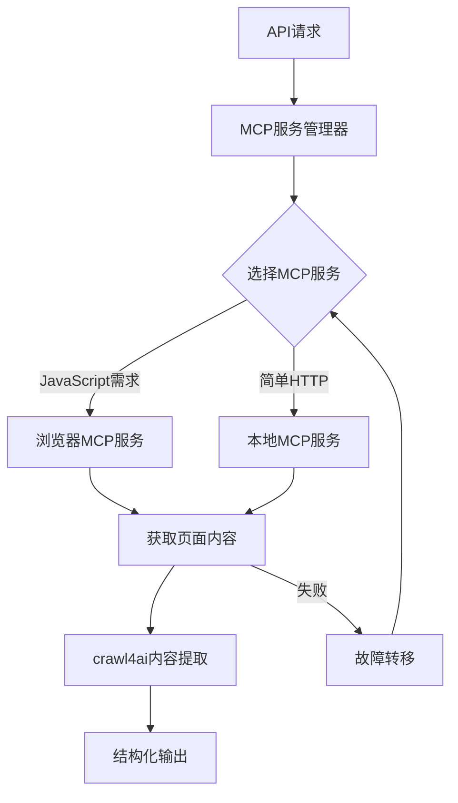
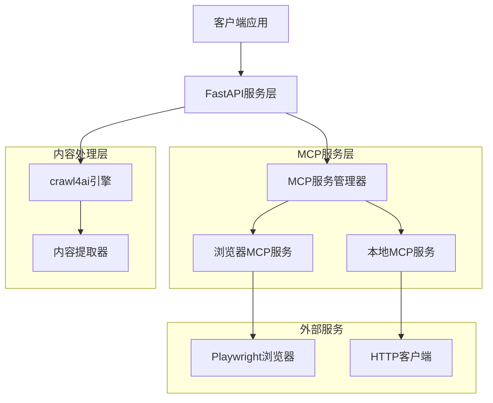
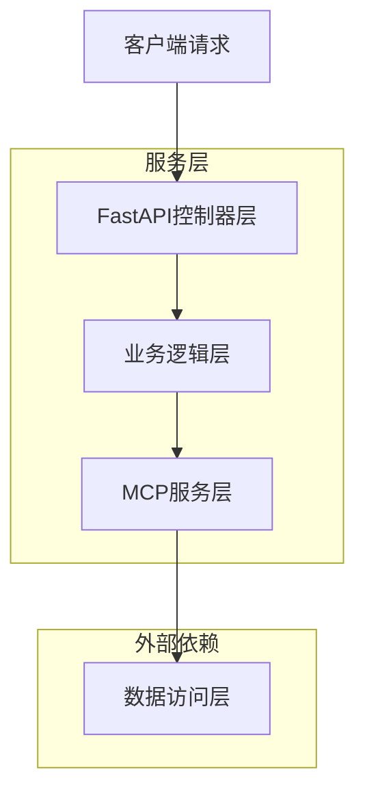
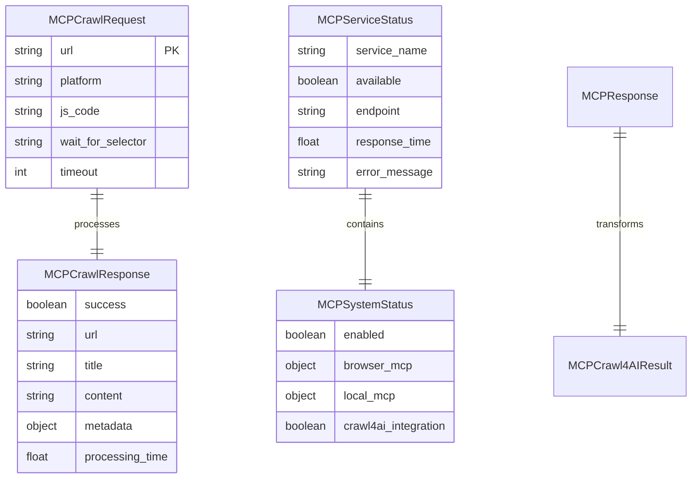

# MCP集成爬虫服务技术文档

## 1. 项目概述

本项目是一个基于Model Context Protocol (MCP)的智能网页爬虫服务，通过集成MCP协议来增强网页内容获取能力。该服务结合了crawl4ai的强大爬取功能和MCP的上下文感知能力，为复杂网页内容提取提供了更加智能和高效的解决方案。

- **核心目标**：通过MCP协议实现智能化的网页内容获取，支持JavaScript渲染、动态内容加载和反爬虫机制绕过
- **适用场景**：社交媒体平台爬取、新闻网站内容提取、电商数据采集等需要处理复杂网页结构的场景
- **技术价值**：提供了一个可扩展的爬虫架构，支持多种MCP服务的智能路由和故障转移

## 2. 核心功能

### 2.1 用户角色

| 角色 | 访问方式 | 核心权限 |
|------|----------|----------|
| 开发者 | API调用 | 可以使用所有爬取功能，配置MCP服务 |
| 系统管理员 | 配置文件 | 可以管理MCP服务配置，监控系统状态 |

### 2.2 功能模块

本MCP集成爬虫服务包含以下主要功能模块：

1. **MCP服务管理**：浏览器MCP服务、本地MCP服务的统一管理和智能路由
2. **内容提取引擎**：基于crawl4ai的智能内容提取和结构化处理
3. **API接口层**：RESTful API接口，支持单URL和批量URL爬取
4. **监控和状态管理**：实时监控MCP服务状态，提供健康检查和故障诊断

### 2.3 页面详情

| 功能模块 | 子模块 | 功能描述 |
|----------|--------|----------|
| MCP服务管理 | 浏览器MCP服务 | 通过浏览器自动化获取JavaScript渲染后的完整页面内容，支持复杂交互和等待条件 |
| MCP服务管理 | 本地MCP服务 | 通过HTTP请求获取静态页面内容，适用于简单网页的快速爬取 |
| MCP服务管理 | 智能路由 | 根据URL特征和爬取需求自动选择最适合的MCP服务，支持故障转移 |
| 内容提取引擎 | HTML解析 | 使用BeautifulSoup和lxml解析HTML结构，提取目标内容 |
| 内容提取引擎 | 内容清洗 | 去除广告、导航等无关内容，保留核心信息 |
| 内容提取引擎 | 结构化输出 | 将提取的内容转换为结构化数据格式（JSON） |
| API接口层 | 单URL爬取 | 提供/mcp/crawl接口，支持单个URL的内容爬取 |
| API接口层 | 批量爬取 | 提供/mcp/crawl/batch接口，支持多个URL的并发爬取 |
| API接口层 | 状态查询 | 提供/mcp/status接口，查询MCP服务运行状态 |
| 监控状态管理 | 健康检查 | 实时监控各MCP服务的可用性和响应时间 |
| 监控状态管理 | 错误处理 | 智能重试机制，支持多种错误类型的自动恢复 |
| 监控状态管理 | 性能监控 | 记录爬取性能指标，支持性能优化分析 |

## 3. 核心流程

### 3.1 MCP服务调用流程

用户通过API接口发起爬取请求 → MCP服务管理器根据URL特征选择合适的服务 → 浏览器MCP或本地MCP获取页面内容 → crawl4ai处理和提取内容 → 返回结构化结果

### 3.2 故障转移流程

主要MCP服务失败 → 自动切换到备用服务 → 重新尝试内容获取 → 记录故障信息 → 返回最终结果或错误信息



## 4. 用户界面设计

### 4.1 设计风格

- **主色调**：深蓝色 (#1e3a8a) 和浅灰色 (#f8fafc)
- **按钮样式**：圆角按钮，支持悬停效果
- **字体**：系统默认字体，代码部分使用等宽字体
- **布局风格**：简洁的卡片式布局，响应式设计
- **图标风格**：使用简洁的线性图标

### 4.2 界面设计概览

| 界面模块 | 组件名称 | UI元素 |
|----------|----------|--------|
| API文档页面 | 接口列表 | 卡片式布局，每个API接口一个卡片，包含请求方法、URL、参数说明 |
| 状态监控页面 | 服务状态面板 | 实时显示各MCP服务状态，使用绿色/红色指示灯表示服务可用性 |
| 配置管理页面 | 配置表单 | 表单式布局，支持MCP服务端点、超时时间、重试次数等参数配置 |

### 4.3 响应式设计

本服务主要面向开发者，采用桌面优先的设计方案，同时支持移动端适配，确保在不同设备上都能正常使用API文档和监控界面。

## 5. 技术架构

### 5.1 架构设计



### 5.2 技术栈

- **后端框架**：FastAPI + uvicorn
- **MCP协议**：mcp + anthropic + fastmcp
- **爬虫引擎**：crawl4ai + playwright
- **HTTP客户端**：aiohttp + requests
- **数据处理**：BeautifulSoup4 + lxml

### 5.3 路由定义

| 路由 | 用途 |
|------|------|
| /mcp/crawl | 单URL爬取接口，接收URL和爬取参数，返回提取的内容 |
| /mcp/crawl/batch | 批量URL爬取接口，支持多个URL并发处理 |
| /mcp/status | MCP服务状态查询，返回各服务的可用性和性能指标 |
| /status | 整体服务健康检查，返回服务运行状态和版本信息 |
| /docs | API文档页面，提供交互式API文档 |

### 5.4 API定义

#### 5.4.1 核心API

**单URL爬取**
```
POST /mcp/crawl
```

请求参数：
| 参数名 | 参数类型 | 是否必需 | 描述 |
|--------|----------|----------|------|
| url | string | true | 要爬取的目标URL |
| platform | string | false | 平台类型（weibo, bilibili, xiaohongshu等） |
| js_code | string | false | 需要执行的JavaScript代码 |
| wait_for_selector | string | false | 等待的CSS选择器 |
| timeout | integer | false | 超时时间（秒） |

响应格式：
| 字段名 | 字段类型 | 描述 |
|--------|----------|------|
| success | boolean | 爬取是否成功 |
| url | string | 原始URL |
| title | string | 页面标题 |
| content | string | 提取的内容 |
| metadata | object | 元数据信息 |
| processing_time | float | 处理时间 |

示例请求：
```json
{
  "url": "https://weibo.com/u/1234567890",
  "platform": "weibo",
  "timeout": 30
}
```

示例响应：
```json
{
  "success": true,
  "url": "https://weibo.com/u/1234567890",
  "title": "用户微博页面",
  "content": "提取的微博内容...",
  "metadata": {
    "platform": "weibo",
    "mcp_service": "browser_mcp"
  },
  "processing_time": 5.23
}
```

**批量URL爬取**
```
POST /mcp/crawl/batch
```

请求参数：
| 参数名 | 参数类型 | 是否必需 | 描述 |
|--------|----------|----------|------|
| urls | array | true | URL列表 |
| platform | string | false | 平台类型 |
| max_concurrent | integer | false | 最大并发数 |

**MCP服务状态查询**
```
GET /mcp/status
```

响应格式：
| 字段名 | 字段类型 | 描述 |
|--------|----------|------|
| enabled | boolean | MCP服务是否启用 |
| browser_mcp | object | 浏览器MCP服务状态 |
| local_mcp | object | 本地MCP服务状态 |
| crawl4ai_integration | boolean | crawl4ai集成状态 |

### 5.5 服务架构图



### 5.6 数据模型

#### 5.6.1 数据模型定义



#### 5.6.2 数据定义语言

**MCP配置表 (mcp_config)**
```json
{
  "mcp_services": {
    "enabled": true,
    "service_priority": ["browser_mcp", "local_mcp"],
    "fallback_enabled": true,
    "default_timeout": 30,
    "max_retries": 3
  },
  "browser_mcp": {
    "mcp_endpoint": "http://localhost:3000/mcp",
    "timeout": 30,
    "user_agent": "Mozilla/5.0 (Windows NT 10.0; Win64; x64) AppleWebKit/537.36",
    "stealth_mode": true,
    "platforms": {
      "weibo": {
        "wait_for": "networkidle",
        "timeout": 45,
        "viewport": {"width": 1920, "height": 1080}
      }
    }
  },
  "local_mcp": {
    "mcp_endpoint": "http://localhost:8080/mcp",
    "timeout": 15,
    "max_retries": 2
  }
}
```

**初始化数据**
```python
# MCP服务配置初始化
default_config = {
    "mcp_services": {
        "enabled": True,
        "service_priority": ["browser_mcp", "local_mcp"],
        "fallback_enabled": True
    }
}
```

## 6. 安装和配置指南

### 6.1 环境要求

- Python 3.8+
- Node.js 16+ (用于某些MCP服务)
- 操作系统：Windows 10+, macOS 10.15+, Ubuntu 18.04+

### 6.2 依赖安装

```bash
# 安装Python依赖
pip install -r requirements.txt

# 安装MCP相关包
pip install mcp anthropic fastmcp

# 安装浏览器驱动
playwright install chromium
```

### 6.3 配置文件设置

1. 复制配置文件模板：
```bash
cp .env.example .env
cp mcp_config.json.example mcp_config.json
```

2. 编辑MCP配置文件 `mcp_config.json`：
```json
{
  "mcp_services": {
    "enabled": true,
    "service_priority": ["browser_mcp", "local_mcp"]
  },
  "browser_mcp": {
    "mcp_endpoint": "http://localhost:3000/mcp",
    "timeout": 30
  },
  "local_mcp": {
    "mcp_endpoint": "http://localhost:8080/mcp",
    "timeout": 15
  }
}
```

### 6.4 启动服务

```bash
# 启动MCP服务器
python browser_mcp_server.py &
python local_mcp_server.py &

# 启动主服务
python main.py
```

## 7. API使用说明

### 7.1 基本使用

**单URL爬取示例**：
```python
import requests

url = "http://localhost:8000/mcp/crawl"
data = {
    "url": "https://example.com",
    "platform": "general",
    "timeout": 30
}

response = requests.post(url, json=data)
result = response.json()
print(result)
```

**批量爬取示例**：
```python
import requests

url = "http://localhost:8000/mcp/crawl/batch"
data = {
    "urls": [
        "https://example1.com",
        "https://example2.com"
    ],
    "max_concurrent": 3
}

response = requests.post(url, json=data)
result = response.json()
print(result)
```

### 7.2 平台特定配置

**微博爬取**：
```python
data = {
    "url": "https://weibo.com/u/1234567890",
    "platform": "weibo",
    "wait_for_selector": ".WB_feed",
    "timeout": 45
}
```

**B站爬取**：
```python
data = {
    "url": "https://space.bilibili.com/123456",
    "platform": "bilibili",
    "js_code": "window.scrollTo(0, document.body.scrollHeight);",
    "timeout": 60
}
```

### 7.3 错误处理

```python
try:
    response = requests.post(url, json=data, timeout=60)
    response.raise_for_status()
    result = response.json()
    
    if result.get('success'):
        print("爬取成功:", result['content'])
    else:
        print("爬取失败:", result.get('error_message'))
        
except requests.exceptions.RequestException as e:
    print(f"请求错误: {e}")
except ValueError as e:
    print(f"JSON解析错误: {e}")
```

## 8. 故障排除和性能优化

### 8.1 常见问题

**问题1：MCP服务连接失败**
- 检查MCP服务器是否正常启动
- 验证端点配置是否正确
- 检查防火墙设置

**问题2：浏览器MCP超时**
- 增加timeout配置值
- 检查目标网站是否有反爬虫机制
- 尝试使用不同的用户代理

**问题3：内容提取不完整**
- 调整wait_for_selector参数
- 增加页面加载等待时间
- 检查CSS选择器是否正确

### 8.2 性能优化建议

**1. 并发控制**
```python
# 合理设置并发数
max_concurrent = min(10, len(urls))  # 不超过10个并发
```

**2. 缓存策略**
```python
# 启用HTTP缓存
session.headers.update({
    'Cache-Control': 'max-age=3600'
})
```

**3. 资源优化**
```python
# 禁用图片加载以提升速度
browser_config = {
    'load_images': False,
    'load_css': False
}
```

**4. 监控和日志**
```python
# 启用详细日志
import logging
logging.basicConfig(level=logging.INFO)
```

### 8.3 性能指标

- **响应时间**：单次爬取平均响应时间应控制在10秒以内
- **成功率**：爬取成功率应保持在95%以上
- **并发能力**：支持最多20个并发请求
- **内存使用**：单个爬取任务内存使用不超过500MB

### 8.4 监控和告警

**健康检查**：
```bash
# 检查服务状态
curl http://localhost:8000/status

# 检查MCP服务状态
curl http://localhost:8000/mcp/status
```

**日志监控**：
```bash
# 查看错误日志
tail -f logs/error.log | grep "ERROR"

# 监控性能指标
tail -f logs/performance.log
```

## 9. 扩展和定制

### 9.1 添加新的MCP服务

1. 创建新的MCP服务类：
```python
class CustomMCPService(BaseMCPService):
    def __init__(self, config):
        super().__init__("custom_mcp", config)
    
    async def fetch_page(self, url, **kwargs):
        # 实现自定义逻辑
        pass
```

2. 注册到服务管理器：
```python
# 在mcp_service.py中添加
self.services['custom_mcp'] = CustomMCPService(config)
```

### 9.2 自定义内容提取器

```python
class CustomExtractor:
    def extract(self, html_content, platform):
        # 实现平台特定的提取逻辑
        soup = BeautifulSoup(html_content, 'html.parser')
        # 自定义提取规则
        return extracted_content
```

### 9.3 插件系统

支持通过插件扩展功能：
```python
# plugins/custom_plugin.py
class CustomPlugin:
    def process_before_crawl(self, url, params):
        # 爬取前处理
        pass
    
    def process_after_crawl(self, result):
        # 爬取后处理
        pass
```

## 10. 总结

本MCP集成爬虫服务提供了一个强大而灵活的网页内容获取解决方案。通过MCP协议的集成，服务能够智能地选择最适合的爬取策略，有效应对各种复杂的网页结构和反爬虫机制。

**主要优势**：
- 智能路由和故障转移机制
- 支持JavaScript渲染和动态内容
- 高度可配置和可扩展
- 完善的错误处理和监控

**适用场景**：
- 社交媒体内容监控
- 新闻资讯聚合
- 电商数据采集
- 学术研究数据收集

通过合理的配置和使用，该服务能够显著提升网页爬取的效率和成功率，为各种数据采集需求提供可靠的技术支持。