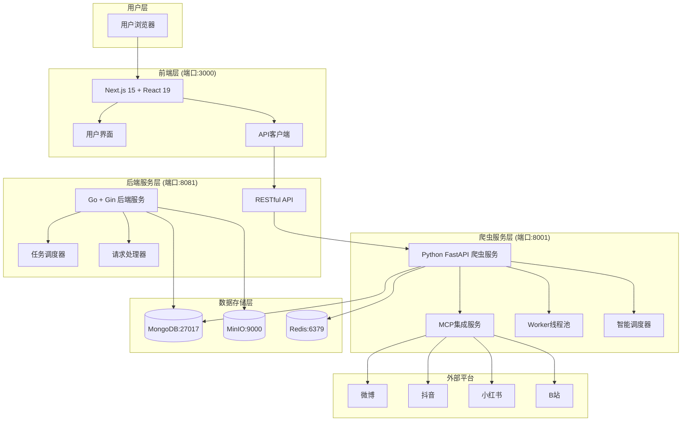
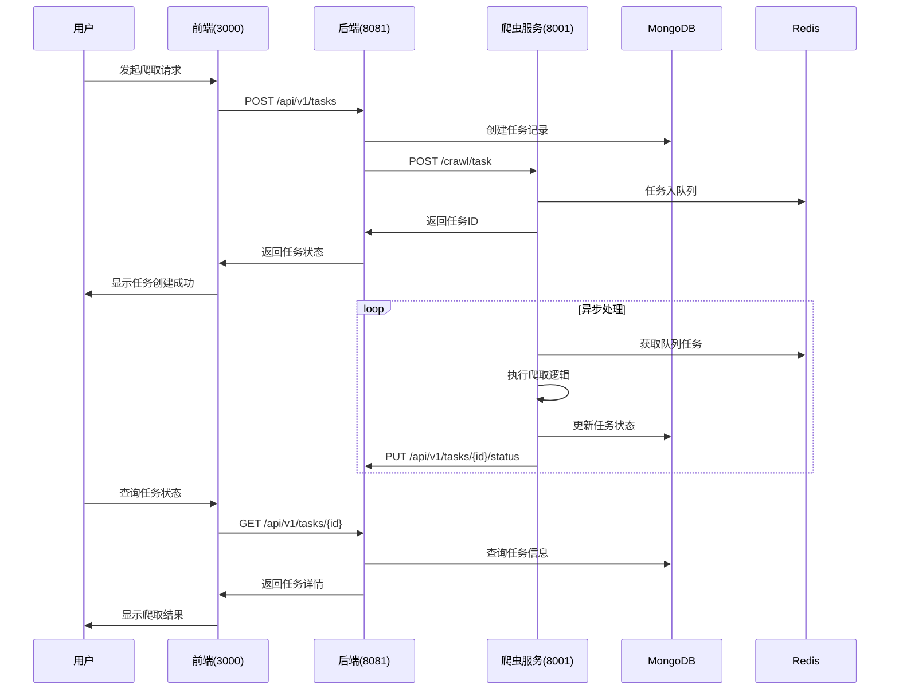
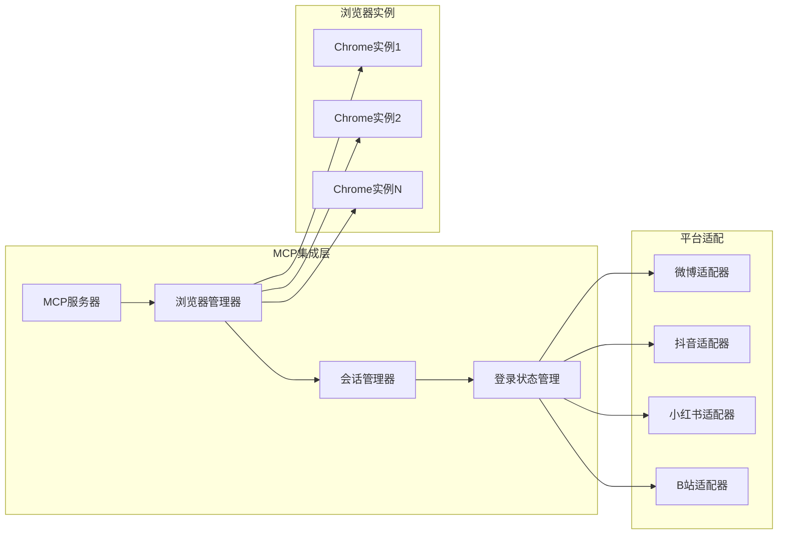
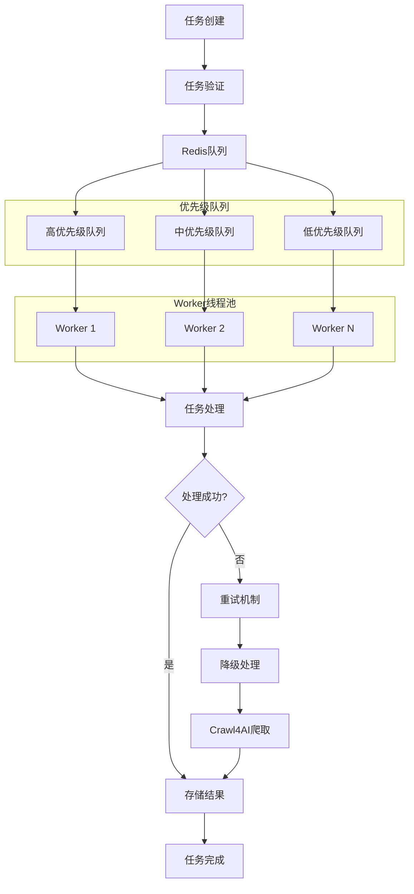
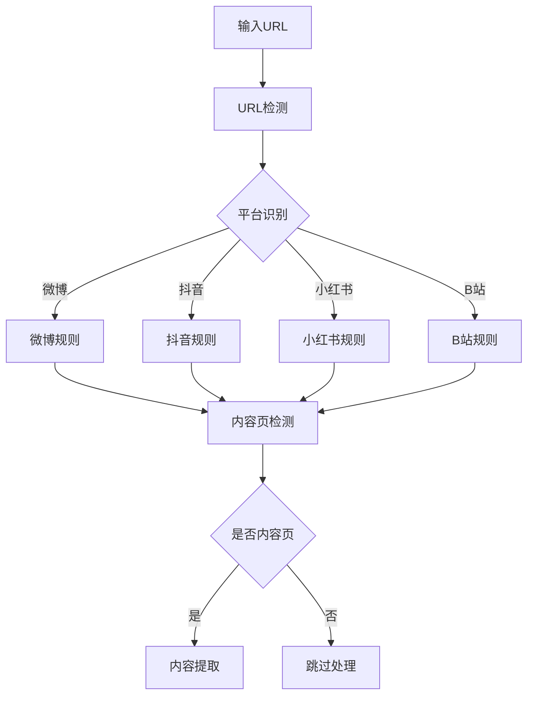
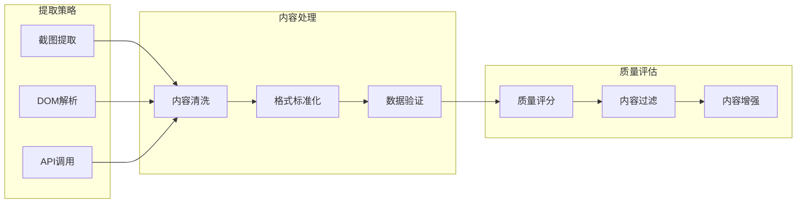
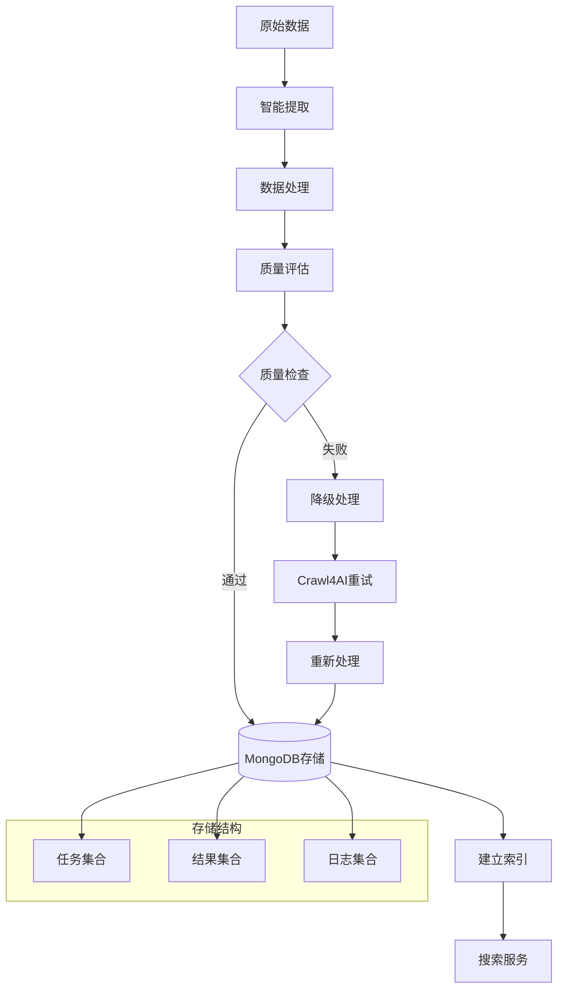
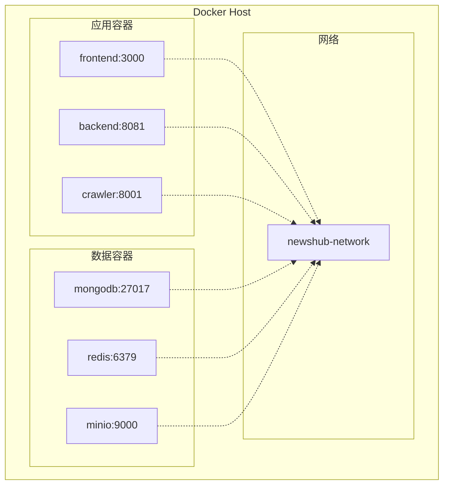
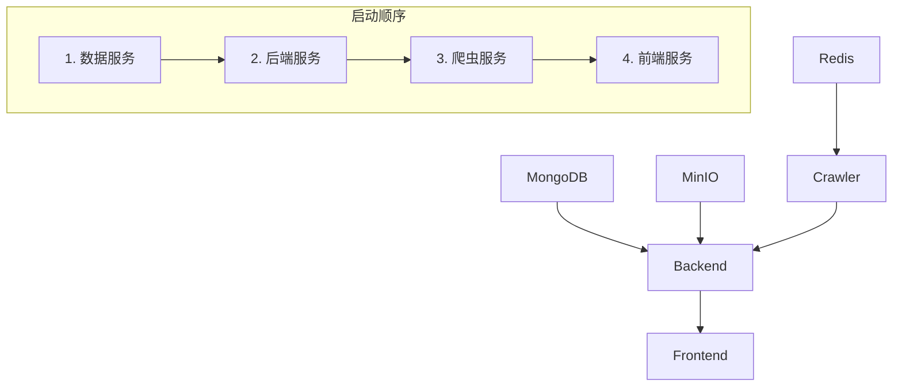
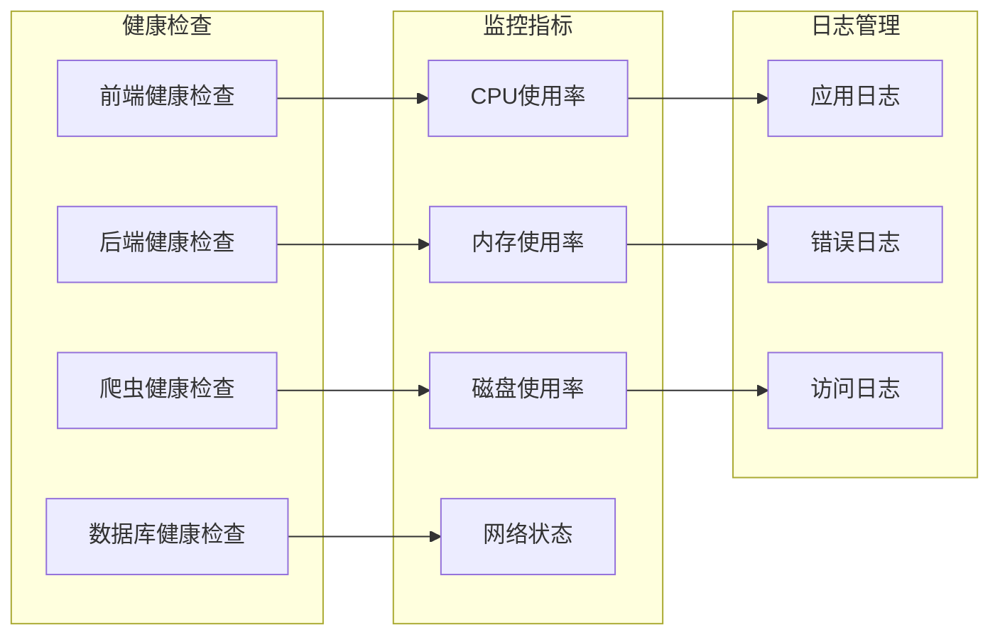

# NewsHub智能爬取系统架构图

## 1. 系统整体架构

### 1.1 核心架构图



### 1.2 技术栈分布

| 层级 | 技术栈 | 端口 | 职责 |
|------|--------|------|------|
| 前端层 | Next.js 15 + React 19 + TypeScript + Tailwind CSS | 3000 | 用户界面、数据展示、交互逻辑 |
| 后端层 | Go + Gin + MongoDB | 8081 | API服务、业务逻辑、数据管理 |
| 爬虫层 | Python + FastAPI + Crawl4AI + MCP | 8001 | 智能爬取、内容提取、任务调度 |
| 数据层 | MongoDB + MinIO + Redis | 27017/9000/6379 | 数据存储、文件存储、缓存队列 |

## 2. 服务间通信架构

### 2.1 通信流程图



### 2.2 API接口规范

#### 后端API (端口:8081)
```
POST /api/v1/tasks          # 创建爬取任务
GET  /api/v1/tasks/{id}     # 查询任务状态
PUT  /api/v1/tasks/{id}/status # 更新任务状态
GET  /api/v1/tasks          # 获取任务列表
```

#### 爬虫服务API (端口:8001)
```
POST /crawl/task           # 创建爬取任务
GET  /crawl/status/{id}    # 查询爬取状态
POST /crawl/manual         # 手动爬取
GET  /health               # 健康检查
```

## 3. MCP集成架构

### 3.1 MCP服务架构



### 3.2 MCP工作流程

1. **浏览器实例管理**
   - 动态创建和销毁Chrome实例
   - 维护登录状态和Cookie
   - 实现会话持久化

2. **平台适配**
   - 针对不同平台的特定逻辑
   - URL识别和内容页检测
   - 反爬虫策略应对

3. **实时爬取触发**
   - 用户导航时自动触发
   - 智能识别目标内容页
   - 异步任务创建和调度

## 4. 异步任务调度架构

### 4.1 任务调度流程



### 4.2 任务状态管理

| 状态 | 描述 | 下一状态 |
|------|------|----------|
| PENDING | 等待处理 | PROCESSING |
| PROCESSING | 正在处理 | SUCCESS/FAILED |
| SUCCESS | 处理成功 | COMPLETED |
| FAILED | 处理失败 | RETRY/FAILED |
| RETRY | 重试中 | PROCESSING/FAILED |
| COMPLETED | 已完成 | - |

## 5. 智能爬取系统核心组件

### 5.1 智能识别层



### 5.2 数据提取层



### 5.3 数据流转架构



## 6. 部署架构

### 6.1 Docker容器化架构



### 6.2 服务依赖关系



### 6.3 配置管理

| 配置文件 | 路径 | 用途 |
|----------|------|------|
| docker-compose.yml | 根目录 | 容器编排配置 |
| config.json | 根目录 | 全局配置 |
| crawler-service/config.json | 爬虫服务 | 爬虫专用配置 |
| .env | 各服务目录 | 环境变量配置 |

## 7. 监控和运维

### 7.1 健康检查



### 7.2 启动脚本

- **start-all.ps1**: 一键启动所有服务
- **stop-all.ps1**: 一键停止所有服务
- **deploy.ps1**: 部署脚本

## 8. 扩展性设计

### 8.1 水平扩展

- **前端**: 支持多实例负载均衡
- **后端**: 无状态设计，支持集群部署
- **爬虫**: Worker线程池动态扩缩容
- **数据库**: MongoDB副本集和分片

### 8.2 功能扩展

- **新平台支持**: 插件化平台适配器
- **AI增强**: 集成更多AI能力
- **实时处理**: 流式数据处理
- **分布式**: 跨节点任务调度

---

*本架构图展示了NewsHub智能爬取系统的完整技术架构，包括各个组件的职责分工、通信方式和数据流转过程，为系统的开发、部署和维护提供了清晰的技术指导。*