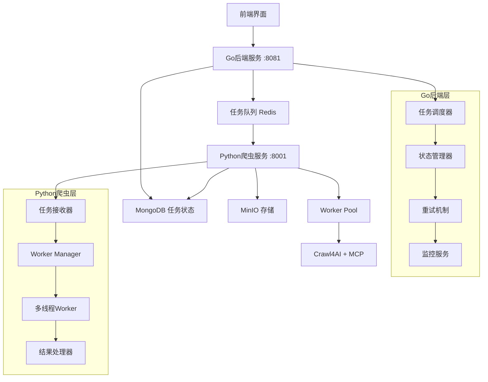

# 异步爬虫任务调度架构设计

## 1. 架构概述

本文档设计了一个基于Go后端调度和Python多线程处理的异步爬虫任务系统，实现高并发、高可用的爬虫服务架构。

### 1.1 设计目标
- **异步处理**：Go后端负责任务调度，Python服务专注爬虫执行
- **高并发**：支持多任务并发执行，提升系统吞吐量
- **可扩展**：支持水平扩展，可增加更多爬虫worker
- **容错性**：完善的错误处理和任务重试机制
- **监控性**：实时任务状态监控和性能指标收集

### 1.2 核心组件
- **Go任务调度器**：负责任务分发、状态管理、重试机制
- **Python爬虫Worker**：多线程处理爬虫任务
- **任务队列**：基于Redis的高性能任务队列
- **状态管理**：MongoDB存储任务状态和结果
- **API网关**：统一的任务提交和状态查询接口

## 2. 系统架构



## 3. 技术实现

### 3.1 Go后端任务调度器

#### 3.1.1 核心结构
```go
type TaskScheduler struct {
    redisClient   *redis.Client
    mongoClient   *mongo.Client
    workerPool    chan struct{}
    taskQueue     chan *CrawlTask
    statusManager *StatusManager
    retryManager  *RetryManager
}

type CrawlTask struct {
    ID          string                 `json:"id" bson:"_id"`
    URL         string                 `json:"url"`
    Platform    string                 `json:"platform"`
    SessionID   string                 `json:"session_id"`
    Priority    int                    `json:"priority"`
    MaxRetries  int                    `json:"max_retries"`
    RetryCount  int                    `json:"retry_count"`
    Status      TaskStatus             `json:"status"`
    CreatedAt   time.Time              `json:"created_at"`
    UpdatedAt   time.Time              `json:"updated_at"`
    Result      *CrawlResult           `json:"result,omitempty"`
    Error       string                 `json:"error,omitempty"`
    Metadata    map[string]interface{} `json:"metadata"`
}

type TaskStatus string

const (
    TaskStatusPending    TaskStatus = "pending"
    TaskStatusQueued     TaskStatus = "queued"
    TaskStatusProcessing TaskStatus = "processing"
    TaskStatusCompleted  TaskStatus = "completed"
    TaskStatusFailed     TaskStatus = "failed"
    TaskStatusRetrying   TaskStatus = "retrying"
)
```

#### 3.1.2 任务调度逻辑
```go
func (ts *TaskScheduler) ScheduleTask(task *CrawlTask) error {
    // 1. 验证任务参数
    if err := ts.validateTask(task); err != nil {
        return err
    }
    
    // 2. 保存任务到数据库
    task.Status = TaskStatusPending
    task.CreatedAt = time.Now()
    if err := ts.saveTask(task); err != nil {
        return err
    }
    
    // 3. 推送到任务队列
    return ts.enqueueTask(task)
}

func (ts *TaskScheduler) StartScheduler() {
    // 启动多个goroutine处理任务分发
    for i := 0; i < ts.config.SchedulerWorkers; i++ {
        go ts.taskDispatcher()
    }
    
    // 启动状态监控goroutine
    go ts.statusMonitor()
    
    // 启动重试处理goroutine
    go ts.retryHandler()
}

func (ts *TaskScheduler) taskDispatcher() {
    for {
        select {
        case task := <-ts.taskQueue:
            // 分发任务到Python爬虫服务
            go ts.dispatchToPython(task)
        case <-ts.ctx.Done():
            return
        }
    }
}
```

### 3.2 Python多线程Worker

#### 3.2.1 Worker管理器
```python
import asyncio
import threading
from concurrent.futures import ThreadPoolExecutor
from queue import Queue, Empty
import redis
import json
from typing import Optional, Dict, Any

class CrawlWorkerManager:
    def __init__(self, config: Dict[str, Any]):
        self.config = config
        self.redis_client = redis.Redis(
            host=config['redis']['host'],
            port=config['redis']['port'],
            decode_responses=True
        )
        self.worker_pool = ThreadPoolExecutor(
            max_workers=config['crawler']['max_workers']
        )
        self.task_queue = Queue(maxsize=config['crawler']['queue_size'])
        self.running = False
        self.workers = []
        
    async def start(self):
        """启动Worker管理器"""
        self.running = True
        
        # 启动任务接收线程
        task_receiver = threading.Thread(target=self._task_receiver)
        task_receiver.daemon = True
        task_receiver.start()
        
        # 启动多个worker线程
        for i in range(self.config['crawler']['max_workers']):
            worker = CrawlWorker(
                worker_id=i,
                task_queue=self.task_queue,
                config=self.config
            )
            worker_thread = threading.Thread(target=worker.run)
            worker_thread.daemon = True
            worker_thread.start()
            self.workers.append(worker)
            
        print(f"Started {len(self.workers)} crawler workers")
        
    def _task_receiver(self):
        """从Redis队列接收任务"""
        while self.running:
            try:
                # 从Redis队列获取任务
                task_data = self.redis_client.blpop(
                    'crawl_tasks', 
                    timeout=1
                )
                
                if task_data:
                    task_json = task_data[1]
                    task = json.loads(task_json)
                    
                    # 添加到本地队列
                    self.task_queue.put(task, timeout=5)
                    
            except Exception as e:
                print(f"Error receiving task: {e}")
                time.sleep(1)
```

#### 3.2.2 Worker实现
```python
class CrawlWorker:
    def __init__(self, worker_id: int, task_queue: Queue, config: Dict[str, Any]):
        self.worker_id = worker_id
        self.task_queue = task_queue
        self.config = config
        self.manual_crawl_service = ManualCrawlService(config)
        self.running = False
        
    def run(self):
        """Worker主循环"""
        self.running = True
        print(f"Worker {self.worker_id} started")
        
        while self.running:
            try:
                # 获取任务（阻塞等待）
                task = self.task_queue.get(timeout=1)
                
                # 处理任务
                self._process_task(task)
                
                # 标记任务完成
                self.task_queue.task_done()
                
            except Empty:
                continue
            except Exception as e:
                print(f"Worker {self.worker_id} error: {e}")
                
    def _process_task(self, task: Dict[str, Any]):
        """处理单个爬虫任务"""
        task_id = task['id']
        
        try:
            print(f"Worker {self.worker_id} processing task {task_id}")
            
            # 更新任务状态为处理中
            self._update_task_status(task_id, 'processing')
            
            # 执行爬虫任务
            result = self.manual_crawl_service.execute_crawl_task(
                url=task['url'],
                platform=task['platform'],
                session_id=task['session_id']
            )
            
            # 更新任务结果
            self._update_task_result(task_id, 'completed', result)
            
            print(f"Worker {self.worker_id} completed task {task_id}")
            
        except Exception as e:
            print(f"Worker {self.worker_id} failed task {task_id}: {e}")
            self._update_task_result(task_id, 'failed', None, str(e))
            
    def _update_task_status(self, task_id: str, status: str):
        """更新任务状态"""
        # 通过API调用Go后端更新状态
        # 实现省略...
        pass
        
    def _update_task_result(self, task_id: str, status: str, result: Any, error: str = None):
        """更新任务结果"""
        # 通过API调用Go后端更新结果
        # 实现省略...
        pass
```

### 3.3 任务队列设计

#### 3.3.1 Redis队列结构
```
# 任务队列
crawl_tasks:high_priority    # 高优先级任务队列
crawl_tasks:normal_priority  # 普通优先级任务队列
crawl_tasks:low_priority     # 低优先级任务队列

# 任务状态
task_status:{task_id}        # 任务状态缓存

# 重试队列
retry_tasks                  # 需要重试的任务

# 死信队列
dead_letter_tasks           # 重试失败的任务
```

#### 3.3.2 优先级调度
```go
func (ts *TaskScheduler) enqueueTask(task *CrawlTask) error {
    taskJSON, err := json.Marshal(task)
    if err != nil {
        return err
    }
    
    // 根据优先级选择队列
    var queueName string
    switch task.Priority {
    case 1:
        queueName = "crawl_tasks:high_priority"
    case 2:
        queueName = "crawl_tasks:normal_priority"
    default:
        queueName = "crawl_tasks:low_priority"
    }
    
    // 推送到Redis队列
    return ts.redisClient.RPush(ts.ctx, queueName, taskJSON).Err()
}
```

### 3.4 API接口设计

#### 3.4.1 Go后端API
```go
// 提交爬虫任务
POST /api/v1/crawl/tasks
{
    "url": "https://example.com",
    "platform": "xiaohongshu",
    "session_id": "session_123",
    "priority": 1,
    "max_retries": 3
}

// 查询任务状态
GET /api/v1/crawl/tasks/{task_id}

// 获取任务列表
GET /api/v1/crawl/tasks?status=completed&limit=10

// 取消任务
DELETE /api/v1/crawl/tasks/{task_id}
```

#### 3.4.2 Python内部API
```python
# 任务状态更新
PUT /internal/tasks/{task_id}/status
{
    "status": "processing",
    "worker_id": "worker_1",
    "updated_at": "2024-01-15T10:30:00Z"
}

# 任务结果提交
PUT /internal/tasks/{task_id}/result
{
    "status": "completed",
    "result": {...},
    "execution_time": 5.2,
    "worker_id": "worker_1"
}
```

## 4. 数据库设计

### 4.1 MongoDB集合结构

#### 4.1.1 任务集合 (crawl_tasks)
```javascript
{
    "_id": "task_123456",
    "url": "https://www.xiaohongshu.com/explore/123",
    "platform": "xiaohongshu",
    "session_id": "session_abc",
    "priority": 1,
    "max_retries": 3,
    "retry_count": 0,
    "status": "completed",
    "created_at": ISODate("2024-01-15T10:00:00Z"),
    "updated_at": ISODate("2024-01-15T10:05:00Z"),
    "started_at": ISODate("2024-01-15T10:01:00Z"),
    "completed_at": ISODate("2024-01-15T10:05:00Z"),
    "worker_id": "worker_1",
    "execution_time": 5.2,
    "result": {
        "title": "爬取到的标题",
        "content": "爬取到的内容",
        "author": "作者信息",
        "publish_time": "2024-01-15T09:00:00Z",
        "tags": ["标签1", "标签2"],
        "images": ["image1.jpg", "image2.jpg"],
        "links": ["link1", "link2"]
    },
    "error": null,
    "metadata": {
        "user_agent": "Mozilla/5.0...",
        "ip_address": "192.168.1.100",
        "retry_reasons": []
    }
}
```

#### 4.1.2 索引设计
```javascript
// 状态查询索引
db.crawl_tasks.createIndex({ "status": 1, "created_at": -1 })

// 平台查询索引
db.crawl_tasks.createIndex({ "platform": 1, "status": 1 })

// 会话查询索引
db.crawl_tasks.createIndex({ "session_id": 1, "created_at": -1 })

// 重试任务索引
db.crawl_tasks.createIndex({ 
    "status": 1, 
    "retry_count": 1, 
    "max_retries": 1 
})

// TTL索引（自动清理完成的任务）
db.crawl_tasks.createIndex(
    { "completed_at": 1 }, 
    { expireAfterSeconds: 2592000 } // 30天后删除
)
```

### 4.2 性能监控集合 (task_metrics)
```javascript
{
    "_id": ObjectId("..."),
    "date": ISODate("2024-01-15T00:00:00Z"),
    "hour": 10,
    "platform": "xiaohongshu",
    "metrics": {
        "total_tasks": 150,
        "completed_tasks": 140,
        "failed_tasks": 8,
        "retried_tasks": 2,
        "avg_execution_time": 4.5,
        "max_execution_time": 15.2,
        "min_execution_time": 1.1
    }
}
```

## 5. 部署配置

### 5.1 Go后端配置
```yaml
# config/scheduler.yaml
scheduler:
  workers: 10                    # 调度器worker数量
  queue_size: 1000              # 内存队列大小
  batch_size: 50                # 批处理大小
  
redis:
  host: "localhost"
  port: 6379
  db: 0
  pool_size: 20
  
mongodb:
  uri: "mongodb://localhost:27017"
  database: "newshub"
  
retry:
  max_retries: 3
  initial_delay: "5s"
  max_delay: "300s"
  multiplier: 2.0
  
monitoring:
  metrics_interval: "60s"
  health_check_interval: "30s"
```

### 5.2 Python爬虫配置
```yaml
# config/crawler.yaml
crawler:
  max_workers: 5                # 最大worker数量
  queue_size: 100              # 本地队列大小
  task_timeout: 30             # 任务超时时间（秒）
  
redis:
  host: "localhost"
  port: 6379
  db: 0
  
api:
  go_backend_url: "http://localhost:8081"
  timeout: 10
  
crawl4ai:
  max_concurrent: 3
  page_timeout: 30
  wait_for_selector_timeout: 10
```

### 5.3 Docker Compose配置
```yaml
version: '3.8'

services:
  redis:
    image: redis:7-alpine
    ports:
      - "6379:6379"
    command: redis-server --appendonly yes
    volumes:
      - redis_data:/data
      
  backend:
    build:
      context: ./server
      dockerfile: Dockerfile
    ports:
      - "8081:8081"
    environment:
      - REDIS_URL=redis://redis:6379
      - MONGODB_URI=mongodb://mongodb:27017
    depends_on:
      - redis
      - mongodb
      
  crawler:
    build:
      context: ./crawler-service
      dockerfile: Dockerfile
    ports:
      - "8001:8001"
    environment:
      - REDIS_URL=redis://redis:6379
      - GO_BACKEND_URL=http://backend:8081
    depends_on:
      - redis
      - backend
      
volumes:
  redis_data:
  mongodb_data:
```

## 6. 监控和运维

### 6.1 性能指标
- **任务吞吐量**：每分钟处理的任务数量
- **任务成功率**：成功完成的任务比例
- **平均执行时间**：任务从开始到完成的平均时间
- **队列长度**：待处理任务队列的长度
- **Worker利用率**：活跃worker的比例
- **重试率**：需要重试的任务比例

### 6.2 告警机制
- 任务失败率超过10%
- 队列长度超过1000
- 平均执行时间超过60秒
- Worker全部繁忙超过5分钟
- Redis连接失败
- MongoDB连接失败

### 6.3 日志管理
```go
// 结构化日志
type TaskLog struct {
    TaskID      string    `json:"task_id"`
    WorkerID    string    `json:"worker_id"`
    Action      string    `json:"action"`
    Status      string    `json:"status"`
    Duration    float64   `json:"duration"`
    Error       string    `json:"error,omitempty"`
    Timestamp   time.Time `json:"timestamp"`
}
```

## 7. 扩展性设计

### 7.1 水平扩展
- **Go后端**：支持多实例部署，通过负载均衡分发请求
- **Python爬虫**：支持多实例部署，自动从Redis队列获取任务
- **Redis集群**：支持Redis Cluster模式，提升队列处理能力
- **MongoDB分片**：支持数据分片，提升存储和查询性能

### 7.2 容错机制
- **任务重试**：自动重试失败的任务，支持指数退避
- **死信队列**：重试失败的任务进入死信队列，人工处理
- **健康检查**：定期检查服务健康状态，自动重启异常服务
- **数据备份**：定期备份任务数据和配置信息

## 8. 安全考虑

### 8.1 访问控制
- API接口需要认证和授权
- Redis访问需要密码保护
- MongoDB启用认证机制
- 内部API使用JWT token

### 8.2 数据保护
- 敏感数据加密存储
- 传输过程使用HTTPS
- 定期清理过期数据
- 访问日志审计

## 9. 实施计划

### 9.1 第一阶段：基础架构
- [ ] 实现Go任务调度器
- [ ] 实现Python Worker管理器
- [ ] 集成Redis任务队列
- [ ] 基础API接口开发

### 9.2 第二阶段：功能完善
- [ ] 实现重试机制
- [ ] 添加监控指标
- [ ] 完善错误处理
- [ ] 性能优化

### 9.3 第三阶段：生产部署
- [ ] 容器化部署
- [ ] 监控告警配置
- [ ] 压力测试
- [ ] 文档完善

## 10. 总结

本异步爬虫任务调度架构通过Go后端负责任务调度和Python多线程处理的分离设计，实现了高并发、高可用的爬虫服务。主要优势包括：

1. **性能提升**：异步处理和多线程并发大幅提升处理能力
2. **可扩展性**：支持水平扩展，可根据负载动态调整资源
3. **可靠性**：完善的重试机制和错误处理确保任务执行成功
4. **可监控性**：丰富的监控指标和告警机制便于运维管理
5. **可维护性**：清晰的架构分层和标准化接口便于维护升级

该架构为NewsHub项目提供了强大的爬虫处理能力，能够满足大规模数据采集的需求。