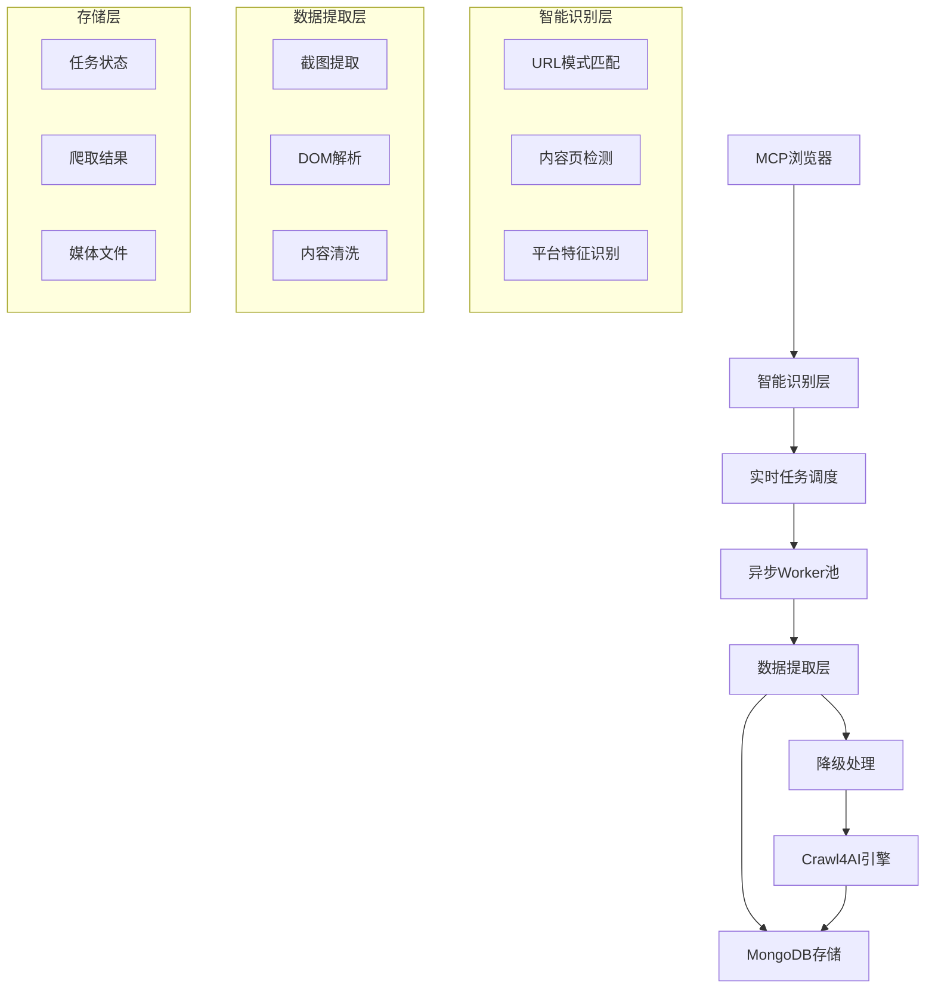
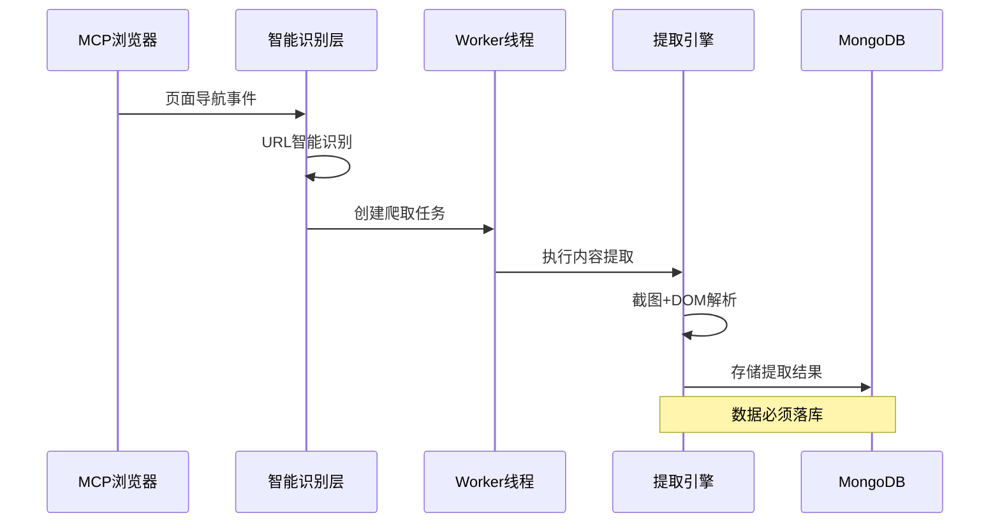
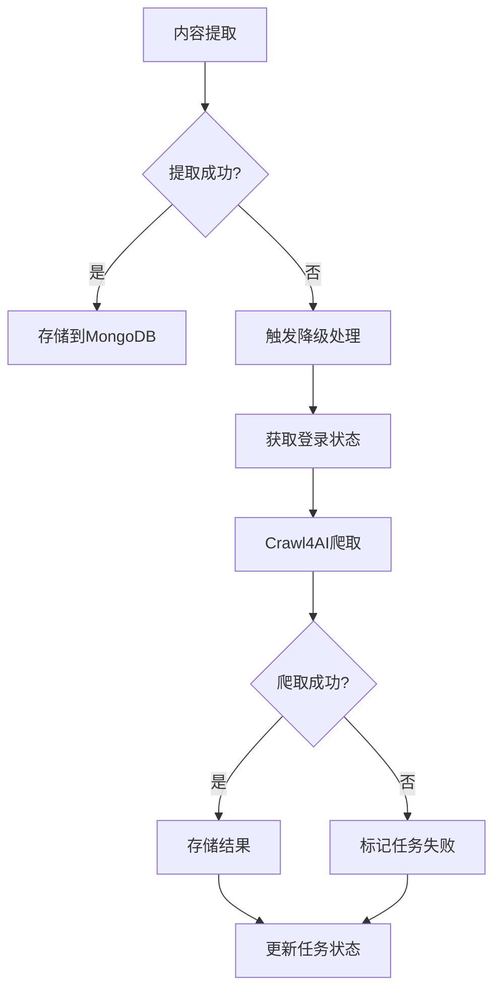

# 智能爬取系统架构与数据流转文档

## 1. 系统整体架构

### 1.1 架构概览


### 1.2 核心组件
- **MCP浏览器**: 实时监控用户浏览行为，触发智能爬取
- **智能识别层**: URL智能识别和内容页判断
- **异步任务调度**: Redis队列管理和任务分发
- **Worker线程池**: 并发处理爬取任务
- **数据存储**: MongoDB持久化存储
- **降级处理**: Crawl4AI备用爬取机制

## 2. 智能识别层详细设计

### 2.1 URL智能识别机制

#### 2.1.1 平台特定识别模式
```python
# 微博内容页识别
weibo_patterns = [
    r'weibo\.com/\d+/[A-Za-z0-9]+',
    r'weibo\.com/u/\d+\?tabtype=feed',
    r'm\.weibo\.cn/detail/[A-Za-z0-9]+'
]

# 小红书内容页识别
xiaohongshu_patterns = [
    r'xiaohongshu\.com/explore/[a-f0-9]+',
    r'xiaohongshu\.com/discovery/item/[a-f0-9]+'
]

# 抖音内容页识别
douyin_patterns = [
    r'douyin\.com/video/\d+',
    r'douyin\.com/user/[^/]+/video/\d+'
]
```

#### 2.1.2 智能识别流程
1. **实时URL监控**: MCP浏览器监听页面导航事件
2. **模式匹配**: 使用正则表达式匹配已知内容页模式
3. **DOM特征检测**: 检查页面关键元素存在性
4. **内容质量评估**: 评估页面内容丰富度
5. **触发决策**: 决定是否启动爬取任务

### 2.2 内容页检测算法

```python
def _is_target_content_page(self, url: str, platform: PlatformType) -> bool:
    """智能判断是否为目标内容页"""
    
    # 1. URL模式匹配
    if not self._match_content_url_patterns(url, platform):
        return False
    
    # 2. 排除非内容页
    excluded_patterns = [
        r'/search[/?]',
        r'/login[/?]',
        r'/settings[/?]',
        r'/profile[/?]'
    ]
    
    for pattern in excluded_patterns:
        if re.search(pattern, url, re.IGNORECASE):
            return False
    
    # 3. 平台特定检测
    return self._platform_specific_detection(url, platform)
```

## 3. 数据提取与存储流程

### 3.1 数据提取层架构

#### 3.1.1 多层提取策略
1. **截图内容提取**: 基于页面截图的视觉内容分析
2. **DOM结构解析**: CSS选择器精确定位
3. **智能内容清洗**: 去除广告和无关内容
4. **格式标准化**: 统一数据格式和编码

#### 3.1.2 提取流程


### 3.2 MongoDB存储策略

#### 3.2.1 数据模型设计
```javascript
// 爬取任务集合
db.crawl_tasks = {
    task_id: String,
    session_id: String,
    user_id: String,
    platform: String,
    url: String,
    status: String, // PENDING, RUNNING, COMPLETED, FAILED
    config: Object,
    created_at: Date,
    updated_at: Date,
    started_at: Date,
    completed_at: Date
}

// 爬取结果集合
db.crawl_results = {
    result_id: String,
    task_id: String,
    url: String,
    platform: String,
    title: String,
    content: String,
    author: String,
    publish_time: Date,
    images: [String],
    video: String,
    metadata: Object,
    extracted_at: Date,
    word_count: Number,
    quality_score: Number
}
```

#### 3.2.2 存储流程
1. **任务创建**: 在`crawl_tasks`集合中创建任务记录
2. **状态更新**: 实时更新任务执行状态
3. **结果存储**: 提取成功后存储到`crawl_results`集合
4. **媒体文件**: 图片和视频上传到MinIO，URL存储到MongoDB
5. **索引优化**: 为查询频繁的字段创建索引

## 4. 降级处理机制

### 4.1 提取失败检测

#### 4.1.1 失败判断条件
```python
def _is_extraction_failed(self, result: dict) -> bool:
    """判断内容提取是否失败"""
    
    # 1. 内容为空或过短
    if not result.get('content') or len(result['content'].strip()) < 10:
        return True
    
    # 2. 关键字段缺失
    required_fields = ['title', 'author', 'publish_time']
    missing_fields = [f for f in required_fields if not result.get(f)]
    if len(missing_fields) > 1:
        return True
    
    # 3. 检测到反爬虫页面
    anti_crawler_indicators = ['验证码', 'captcha', '请稍后再试', 'blocked']
    content_lower = result['content'].lower()
    if any(indicator in content_lower for indicator in anti_crawler_indicators):
        return True
    
    return False
```

### 4.2 Crawl4AI降级流程

#### 4.2.1 降级触发机制


#### 4.2.2 Crawl4AI集成
```python
async def _fallback_to_crawl4ai(self, task_id: str, url: str, platform: PlatformType):
    """降级到Crawl4AI进行爬取"""
    
    try:
        # 1. 获取登录状态和Cookie
        session_data = await self._get_session_data(task_id)
        cookies = await self.cookie_store.get_cookies(platform)
        
        # 2. 配置Crawl4AI
        crawl_config = {
            'url': url,
            'cookies': cookies,
            'headers': session_data.get('headers', {}),
            'wait_for': 'networkidle',
            'timeout': 30000
        }
        
        # 3. 执行Crawl4AI爬取
        result = await self.crawler.arun(**crawl_config)
        
        # 4. 处理爬取结果
        if result.success:
            extracted_data = await self._process_crawl4ai_result(result)
            await self._store_crawl_result(task_id, extracted_data)
            return True
        
        return False
        
    except Exception as e:
        logger.error(f"Crawl4AI降级处理失败: {e}")
        return False
```

## 5. 系统协作关系

### 5.1 MCP浏览器集成

#### 5.1.1 实时监控机制
```python
async def _handle_page_navigation(self, instance_id: str, url: str):
    """处理页面导航事件"""
    
    try:
        # 1. 智能URL识别
        platform = self._detect_platform(url)
        if not platform or not self._is_target_content_page(url, platform):
            return
        
        # 2. 创建高优先级任务
        task_data = {
            'url': url,
            'platform': platform,
            'priority': 'HIGH',
            'source': 'MCP_BROWSER',
            'instance_id': instance_id
        }
        
        # 3. 立即加入任务队列
        await self.manual_crawl_service.create_crawl_task_immediate(task_data)
        
        # 4. 通知Worker线程
        await self._notify_idle_workers()
        
    except Exception as e:
        logger.error(f"页面导航处理失败: {e}")
```

### 5.2 异步任务调度

#### 5.2.1 Redis队列管理
```python
class TaskScheduler:
    def __init__(self):
        self.redis_client = redis.Redis()
        self.priority_queues = {
            'HIGH': 'crawl_tasks:high',
            'MEDIUM': 'crawl_tasks:medium',
            'LOW': 'crawl_tasks:low'
        }
    
    async def enqueue_task(self, task_data: dict, priority: str = 'MEDIUM'):
        """将任务加入优先级队列"""
        queue_name = self.priority_queues.get(priority, 'crawl_tasks:medium')
        await self.redis_client.lpush(queue_name, json.dumps(task_data))
    
    async def dequeue_task(self) -> dict:
        """按优先级出队任务"""
        for priority in ['HIGH', 'MEDIUM', 'LOW']:
            queue_name = self.priority_queues[priority]
            task_data = await self.redis_client.brpop(queue_name, timeout=1)
            if task_data:
                return json.loads(task_data[1])
        return None
```

### 5.3 Worker线程池管理

#### 5.3.1 智能调度机制
```python
class WorkerManager:
    def __init__(self, max_workers: int = 5):
        self.max_workers = max_workers
        self.active_workers = {}
        self.idle_workers = set()
    
    async def _worker_idle_detection(self, worker_id: str):
        """检测Worker线程闲置状态"""
        while True:
            if worker_id in self.idle_workers:
                # 立即检查队列中是否有任务
                task = await self.task_scheduler.dequeue_task()
                if task:
                    await self._assign_task_to_worker(worker_id, task)
            
            await asyncio.sleep(0.5)  # 500ms检测间隔
    
    async def _assign_task_to_worker(self, worker_id: str, task: dict):
        """将任务分配给Worker"""
        self.idle_workers.discard(worker_id)
        self.active_workers[worker_id] = task
        
        # 执行任务
        await self._execute_crawl_task(worker_id, task)
        
        # 任务完成后标记为闲置
        self.active_workers.pop(worker_id, None)
        self.idle_workers.add(worker_id)
```

## 6. 数据质量保证

### 6.1 内容质量评估

#### 6.1.1 质量评分算法
```python
def _calculate_quality_score(self, extracted_data: dict) -> float:
    """计算内容质量评分"""
    score = 0.0
    
    # 1. 内容完整性 (40%)
    required_fields = ['title', 'content', 'author', 'publish_time']
    completeness = sum(1 for field in required_fields if extracted_data.get(field)) / len(required_fields)
    score += completeness * 0.4
    
    # 2. 内容丰富度 (30%)
    content_length = len(extracted_data.get('content', ''))
    richness = min(content_length / 500, 1.0)  # 500字为满分
    score += richness * 0.3
    
    # 3. 媒体文件 (20%)
    media_score = 0
    if extracted_data.get('images'):
        media_score += 0.5
    if extracted_data.get('video'):
        media_score += 0.5
    score += media_score * 0.2
    
    # 4. 时间有效性 (10%)
    publish_time = extracted_data.get('publish_time')
    if publish_time and self._is_recent_content(publish_time):
        score += 0.1
    
    return min(score, 1.0)
```

### 6.2 错误恢复机制

#### 6.2.1 智能重试策略
```python
class RetryManager:
    def __init__(self):
        self.retry_delays = [1, 3, 5, 10]  # 递增延迟
        self.max_retries = 4
    
    async def execute_with_retry(self, task_func, task_data: dict):
        """带重试的任务执行"""
        last_error = None
        
        for attempt in range(self.max_retries):
            try:
                result = await task_func(task_data)
                if self._is_successful_result(result):
                    return result
                
            except Exception as e:
                last_error = e
                error_type = self._classify_error(str(e))
                
                # 根据错误类型决定是否重试
                if error_type in ['network_timeout', 'rate_limit']:
                    delay = self.retry_delays[min(attempt, len(self.retry_delays) - 1)]
                    await asyncio.sleep(delay)
                    continue
                else:
                    # 不可重试的错误，直接失败
                    break
        
        # 所有重试都失败，触发降级处理
        return await self._trigger_fallback(task_data, last_error)
```

## 7. 性能优化策略

### 7.1 并发控制
- **最大并发数**: 5个Worker线程
- **队列容量**: Redis队列无限制，但设置内存限制
- **超时控制**: 单个任务最大执行时间30秒
- **资源回收**: 自动清理超时和失败的任务

### 7.2 缓存策略
- **URL去重**: Redis Set存储已爬取URL，避免重复爬取
- **内容缓存**: 24小时内相同URL不重复爬取
- **登录状态缓存**: Cookie和Session信息缓存1小时

### 7.3 监控指标
- **任务成功率**: 成功完成的任务占比
- **平均响应时间**: 从任务创建到完成的平均时间
- **降级处理率**: 需要Crawl4AI降级处理的任务占比
- **数据质量分布**: 提取内容的质量评分分布

## 8. 总结

本智能爬取系统通过多层架构设计，实现了从URL智能识别到数据持久化存储的完整流程：

1. **智能识别层**确保只爬取有价值的内容页面
2. **数据提取层**通过多种策略保证内容提取质量
3. **存储层**将所有数据可靠存储到MongoDB
4. **降级机制**在提取失败时自动切换到Crawl4AI
5. **协作机制**确保各组件高效协同工作

系统具备高可靠性、高性能和强扩展性，能够满足大规模内容爬取的需求。