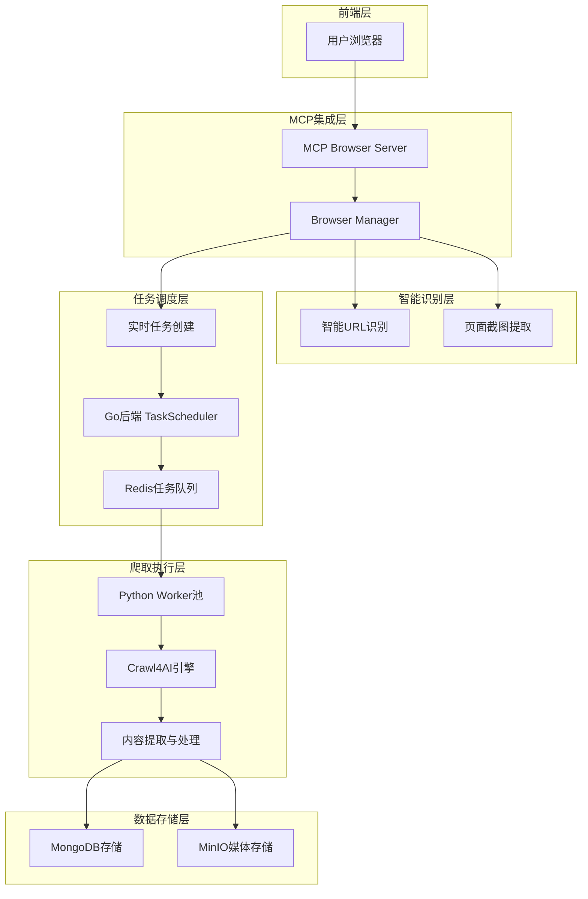
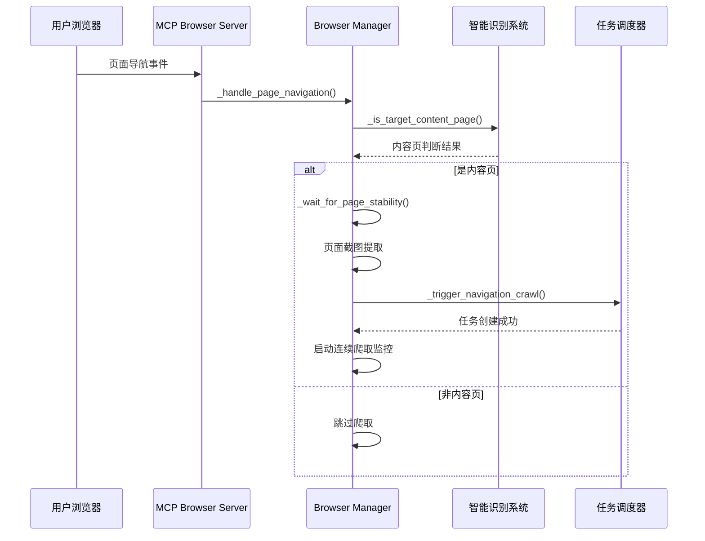

# NewsHub 爬取系统架构与逻辑文档

## 1. 整体架构概述

### 1.1 系统架构图


### 1.2 核心组件交互关系

- **前端服务 (Next.js 3000)**: 用户界面，展示爬取结果和任务状态
- **后端服务 (Go 8081)**: 任务调度中心，API网关，数据管理
- **爬虫服务 (Python 8001)**: MCP集成，智能爬取，内容提取
- **数据层**: MongoDB (27017) + MinIO (9000) + Redis (6379)

## 2. MCP集成的智能实时爬取系统

### 2.1 MCP Browser Server 工作流程



### 2.2 智能URL识别机制

#### 2.2.1 三阶段判断逻辑

**阶段1: URL模式匹配**
- 平台特定模式识别（微博、抖音、小红书、B站等）
- 通用内容页模式匹配
- 负面指标检测（登录页、首页、搜索页）

**阶段2: URL结构分析**
- 路径深度评估（深度越深，内容页可能性越高）
- 内容指示性路径段识别（post、article、video等）
- ID模式检测（数字ID、UUID等）
- 查询参数分析

**阶段3: 页面内容分析**（可选）
- 页面元素检测
- 内容丰富度评估
- 平台特定元素识别

#### 2.2.2 置信度评分机制

```python
# 置信度计算示例
confidence_score = (
    url_pattern_score * 0.4 +      # URL模式权重40%
    url_structure_score * 0.3 +    # URL结构权重30%
    page_content_score * 0.3       # 页面内容权重30%
)

# 阈值判断
if confidence_score >= 0.7:
    return True  # 高置信度内容页
elif confidence_score >= 0.4:
    return "maybe"  # 可能的内容页，需进一步验证
else:
    return False  # 非内容页
```

### 2.3 页面截图与内容提取

#### 2.3.1 截图机制
```python
async def capture_page_screenshot(self, page, url: str) -> Optional[str]:
    """捕获页面截图并上传到MinIO"""
    try:
        # 等待页面稳定
        await self._wait_for_page_stability(page)
        
        # 截图配置
        screenshot_options = {
            'full_page': True,
            'type': 'png',
            'quality': 85
        }
        
        # 执行截图
        screenshot_data = await page.screenshot(**screenshot_options)
        
        # 上传到MinIO
        screenshot_url = await self._upload_screenshot_to_minio(
            screenshot_data, url
        )
        
        return screenshot_url
    except Exception as e:
        logger.error(f"截图失败: {e}")
        return None
```

#### 2.3.2 基于截图的内容分析
- 使用OCR技术提取文本内容
- 图像识别检测内容类型
- 布局分析确定内容结构

## 3. 异步任务调度机制

### 3.1 Go后端TaskScheduler架构

```go
type TaskScheduler struct {
    dispatcher    *Dispatcher      // 任务分发器
    statusManager *StatusManager   // 状态管理器
    retryManager  *RetryManager    // 重试管理器
    redisClient   *redis.Client    // Redis客户端
    mongoClient   *mongo.Client    // MongoDB客户端
}

// 任务调度流程
func (ts *TaskScheduler) ScheduleTask(task *CrawlTask) error {
    // 1. 任务验证
    if err := ts.validateTask(task); err != nil {
        return err
    }
    
    // 2. 存储到MongoDB
    if err := ts.storeTask(task); err != nil {
        return err
    }
    
    // 3. 推送到Redis队列
    if err := ts.dispatcher.DispatchTask(task); err != nil {
        return err
    }
    
    // 4. 更新任务状态
    ts.statusManager.UpdateStatus(task.ID, "queued")
    
    return nil
}
```

### 3.2 Python Worker池管理

```python
class WorkerManager:
    def __init__(self, config: WorkerConfig):
        self.config = config
        self.workers: List[CrawlWorker] = []
        self.task_queue = asyncio.Queue()
        self.idle_workers = set()
        self.running = False
    
    async def start(self):
        """启动Worker池"""
        # 创建Worker线程
        for i in range(self.config.max_workers):
            worker = CrawlWorker(f"worker-{i}", self)
            self.workers.append(worker)
            asyncio.create_task(worker.start())
        
        # 启动任务分发器
        asyncio.create_task(self._task_dispatcher())
        
        # 启动闲置检测器
        asyncio.create_task(self._idle_detector())
    
    async def _idle_detector(self):
        """检测闲置Worker并立即分配任务"""
        while self.running:
            if self.idle_workers and not self.task_queue.empty():
                # 立即分配任务给闲置Worker
                idle_worker = self.idle_workers.pop()
                task = await self.task_queue.get()
                await idle_worker.assign_task(task)
            
            await asyncio.sleep(0.1)  # 100ms检测间隔
```

### 3.3 任务优先级调度

```python
class PriorityTaskQueue:
    def __init__(self):
        self.ultra_high = asyncio.Queue()    # 超高优先级（实时爬取）
        self.high = asyncio.Queue()          # 高优先级
        self.normal = asyncio.Queue()        # 普通优先级
        self.low = asyncio.Queue()           # 低优先级
    
    async def get_next_task(self) -> Optional[CrawlTask]:
        """按优先级获取下一个任务"""
        # 优先级顺序：超高 > 高 > 普通 > 低
        for queue in [self.ultra_high, self.high, self.normal, self.low]:
            if not queue.empty():
                return await queue.get()
        return None
    
    async def put_task(self, task: CrawlTask):
        """根据优先级放入对应队列"""
        priority_map = {
            'ultra_high': self.ultra_high,  # MCP实时爬取
            'high': self.high,
            'normal': self.normal,
            'low': self.low
        }
        
        queue = priority_map.get(task.priority, self.normal)
        await queue.put(task)
```

## 4. 智能内容提取机制

### 4.1 Crawl4AI集成

```python
class SmartContentExtractor:
    def __init__(self):
        self.crawl4ai = AsyncWebCrawler(
            headless=True,
            browser_type="chromium",
            viewport_width=1920,
            viewport_height=1080
        )
    
    async def extract_content(self, url: str, platform: str) -> CrawlResult:
        """智能内容提取"""
        try:
            # 1. 获取平台特定配置
            extraction_config = self._get_platform_config(platform)
            
            # 2. 执行爬取
            result = await self.crawl4ai.arun(
                url=url,
                css_selector=extraction_config.get('css_selector'),
                extraction_strategy=extraction_config.get('strategy'),
                chunking_strategy=extraction_config.get('chunking'),
                wait_for=extraction_config.get('wait_for', 3)
            )
            
            # 3. 内容后处理
            processed_content = await self._post_process_content(
                result, platform
            )
            
            return processed_content
            
        except Exception as e:
            logger.error(f"内容提取失败 {url}: {e}")
            raise
```

### 4.2 平台特定提取策略

```python
PLATFORM_CONFIGS = {
    'weibo': {
        'css_selector': '.WB_detail .WB_text',
        'strategy': LLMExtractionStrategy(
            provider="ollama/llama3.2",
            instruction="提取微博内容、作者、发布时间和互动数据"
        ),
        'wait_for': 5
    },
    'xiaohongshu': {
        'css_selector': '.note-item .content',
        'strategy': CosineStrategy(
            semantic_filter="小红书笔记内容"
        ),
        'wait_for': 3
    },
    'douyin': {
        'css_selector': '.video-info-detail',
        'strategy': LLMExtractionStrategy(
            provider="ollama/llama3.2",
            instruction="提取抖音视频标题、描述、作者和统计数据"
        ),
        'wait_for': 8
    }
}
```

## 5. 数据存储与状态管理

### 5.1 MongoDB数据模型

```javascript
// 爬取任务集合
db.crawl_tasks.createIndex({ "url": 1, "platform": 1 })
db.crawl_tasks.createIndex({ "status": 1, "created_at": -1 })
db.crawl_tasks.createIndex({ "priority": -1, "created_at": 1 })

// 任务文档结构
{
  "_id": ObjectId,
  "url": "https://weibo.com/detail/123456",
  "platform": "weibo",
  "status": "completed",  // pending, processing, completed, failed
  "priority": "ultra_high",
  "created_at": ISODate,
  "started_at": ISODate,
  "completed_at": ISODate,
  "retry_count": 0,
  "error_message": null,
  "result": {
    "title": "提取的标题",
    "content": "提取的内容",
    "author": "作者信息",
    "publish_time": ISODate,
    "media_files": ["minio://bucket/file1.jpg"],
    "metadata": {}
  }
}
```

### 5.2 Redis队列结构

```python
# Redis队列键名规范
QUEUE_KEYS = {
    'ultra_high': 'crawl:queue:ultra_high',
    'high': 'crawl:queue:high', 
    'normal': 'crawl:queue:normal',
    'low': 'crawl:queue:low',
    'dead_letter': 'crawl:queue:dead_letter',  # 死信队列
    'processing': 'crawl:processing',          # 处理中任务
    'stats': 'crawl:stats'                     # 统计信息
}

# 任务状态缓存
STATUS_CACHE_KEY = "crawl:status:{task_id}"
WORKER_STATUS_KEY = "crawl:workers:{worker_id}"
```

### 5.3 MinIO媒体文件存储

```python
class MediaStorageManager:
    def __init__(self):
        self.minio_client = Minio(
            endpoint='localhost:9000',
            access_key=os.getenv('MINIO_ACCESS_KEY'),
            secret_key=os.getenv('MINIO_SECRET_KEY'),
            secure=False
        )
        self.bucket_name = 'crawled-media'
    
    async def upload_media_file(self, file_data: bytes, 
                               file_type: str, task_id: str) -> str:
        """上传媒体文件到MinIO"""
        try:
            # 生成文件路径
            file_extension = self._get_file_extension(file_type)
            file_path = f"{task_id}/{uuid.uuid4()}.{file_extension}"
            
            # 上传文件
            self.minio_client.put_object(
                bucket_name=self.bucket_name,
                object_name=file_path,
                data=io.BytesIO(file_data),
                length=len(file_data),
                content_type=file_type
            )
            
            # 返回访问URL
            return f"minio://{self.bucket_name}/{file_path}"
            
        except Exception as e:
            logger.error(f"媒体文件上传失败: {e}")
            raise
```

## 6. 错误处理与重试机制

### 6.1 智能重试策略

```python
class SmartRetryManager:
    def __init__(self):
        self.max_retries = 3
        self.retry_delays = [1, 5, 15]  # 指数退避
        self.error_classifiers = {
            'network': ['ConnectionError', 'TimeoutError'],
            'anti_crawler': ['403', '429', 'Captcha'],
            'content': ['EmptyContent', 'ParseError'],
            'system': ['OutOfMemory', 'DiskFull']
        }
    
    async def should_retry(self, error: Exception, 
                          retry_count: int) -> bool:
        """判断是否应该重试"""
        if retry_count >= self.max_retries:
            return False
        
        error_type = self._classify_error(error)
        
        # 不同错误类型的重试策略
        if error_type == 'network':
            return True  # 网络错误总是重试
        elif error_type == 'anti_crawler':
            return retry_count < 2  # 反爬虫最多重试2次
        elif error_type == 'content':
            return retry_count < 1  # 内容错误最多重试1次
        else:
            return False  # 系统错误不重试
    
    async def get_retry_delay(self, retry_count: int, 
                             error_type: str) -> int:
        """获取重试延迟时间"""
        base_delay = self.retry_delays[min(retry_count, len(self.retry_delays)-1)]
        
        # 反爬虫错误需要更长延迟
        if error_type == 'anti_crawler':
            base_delay *= 3
        
        # 添加随机抖动
        jitter = random.uniform(0.5, 1.5)
        return int(base_delay * jitter)
```

### 6.2 错误监控与告警

```python
class ErrorMonitor:
    def __init__(self):
        self.error_stats = defaultdict(int)
        self.alert_thresholds = {
            'error_rate': 0.1,      # 错误率超过10%
            'consecutive_failures': 5,  # 连续失败5次
            'queue_backlog': 1000   # 队列积压超过1000个任务
        }
    
    async def record_error(self, task_id: str, error: Exception):
        """记录错误并检查告警条件"""
        error_type = self._classify_error(error)
        self.error_stats[error_type] += 1
        
        # 检查告警条件
        if await self._should_alert(error_type):
            await self._send_alert(error_type, error)
    
    async def _send_alert(self, error_type: str, error: Exception):
        """发送告警通知"""
        alert_message = {
            'type': 'crawl_system_error',
            'error_type': error_type,
            'message': str(error),
            'timestamp': datetime.utcnow().isoformat(),
            'stats': dict(self.error_stats)
        }
        
        # 发送到监控系统
        logger.critical(f"爬取系统告警: {alert_message}")
```

## 7. 性能优化与监控

### 7.1 性能指标监控

```python
class PerformanceMonitor:
    def __init__(self):
        self.metrics = {
            'tasks_per_second': 0,
            'average_processing_time': 0,
            'success_rate': 0,
            'queue_length': 0,
            'active_workers': 0,
            'memory_usage': 0,
            'cpu_usage': 0
        }
    
    async def collect_metrics(self):
        """收集性能指标"""
        # 任务处理速度
        self.metrics['tasks_per_second'] = await self._calculate_tps()
        
        # 平均处理时间
        self.metrics['average_processing_time'] = await self._calculate_avg_time()
        
        # 成功率
        self.metrics['success_rate'] = await self._calculate_success_rate()
        
        # 队列长度
        self.metrics['queue_length'] = await self._get_queue_length()
        
        # 系统资源使用
        self.metrics['memory_usage'] = psutil.virtual_memory().percent
        self.metrics['cpu_usage'] = psutil.cpu_percent()
        
        return self.metrics
```

### 7.2 自动扩缩容机制

```python
class AutoScaler:
    def __init__(self, worker_manager: WorkerManager):
        self.worker_manager = worker_manager
        self.min_workers = 2
        self.max_workers = 10
        self.scale_up_threshold = 0.8    # CPU使用率80%时扩容
        self.scale_down_threshold = 0.3  # CPU使用率30%时缩容
    
    async def auto_scale(self):
        """自动扩缩容"""
        current_workers = len(self.worker_manager.workers)
        cpu_usage = psutil.cpu_percent()
        queue_length = await self._get_total_queue_length()
        
        # 扩容条件
        if (cpu_usage > self.scale_up_threshold or 
            queue_length > current_workers * 10) and \
           current_workers < self.max_workers:
            await self._scale_up()
        
        # 缩容条件
        elif cpu_usage < self.scale_down_threshold and \
             queue_length < current_workers * 2 and \
             current_workers > self.min_workers:
            await self._scale_down()
```

## 8. 部署与运维

### 8.1 Docker容器化部署

```yaml
# docker-compose.yml 核心服务配置
version: '3.8'
services:
  crawler:
    build:
      context: .
      dockerfile: Dockerfile.crawler
    ports:
      - "8001:8001"
    environment:
      - MONGODB_URL=mongodb://mongodb:27017
      - REDIS_URL=redis://redis:6379
      - MINIO_ENDPOINT=minio:9000
    depends_on:
      - mongodb
      - redis
      - minio
    volumes:
      - ./crawler-service:/app
      - /tmp/.X11-unix:/tmp/.X11-unix:rw
    restart: unless-stopped
    
  backend:
    build:
      context: .
      dockerfile: Dockerfile.backend
    ports:
      - "8081:8081"
    environment:
      - MONGODB_URL=mongodb://mongodb:27017
      - REDIS_URL=redis://redis:6379
    depends_on:
      - mongodb
      - redis
    restart: unless-stopped
```

### 8.2 健康检查与监控

```python
# 健康检查端点
@app.get("/health")
async def health_check():
    """系统健康检查"""
    health_status = {
        'status': 'healthy',
        'timestamp': datetime.utcnow().isoformat(),
        'services': {}
    }
    
    # 检查各个服务状态
    services_to_check = [
        ('mongodb', check_mongodb_health),
        ('redis', check_redis_health),
        ('minio', check_minio_health),
        ('workers', check_workers_health)
    ]
    
    for service_name, check_func in services_to_check:
        try:
            service_status = await check_func()
            health_status['services'][service_name] = service_status
        except Exception as e:
            health_status['services'][service_name] = {
                'status': 'unhealthy',
                'error': str(e)
            }
            health_status['status'] = 'degraded'
    
    return health_status
```

## 9. 总结

### 9.1 系统特点

1. **智能化**: 基于AI的URL识别和内容提取
2. **实时性**: MCP集成实现浏览器实时爬取
3. **高并发**: 异步任务调度和Worker池管理
4. **可扩展**: 支持多平台和自动扩缩容
5. **可靠性**: 完善的错误处理和重试机制
6. **可观测**: 全面的监控和告警系统

### 9.2 数据流转路径

```
用户浏览 → MCP检测 → URL智能识别 → 任务创建 → 
Redis队列 → Worker分配 → Crawl4AI爬取 → 内容提取 → 
数据清洗 → MongoDB存储 → MinIO媒体存储 → 前端展示
```

### 9.3 核心优势

- **零配置爬取**: 用户只需正常浏览，系统自动识别并爬取内容页
- **智能过滤**: 避免爬取非内容页，提高效率和质量
- **实时响应**: 点击后立即创建任务，线程闲置时立即执行
- **平台适配**: 针对不同平台优化的提取策略
- **容错能力**: 多层次的错误处理和恢复机制

该爬取系统通过MCP集成实现了真正的智能化、自动化内容爬取，为用户提供了无感知的高质量内容获取体验。