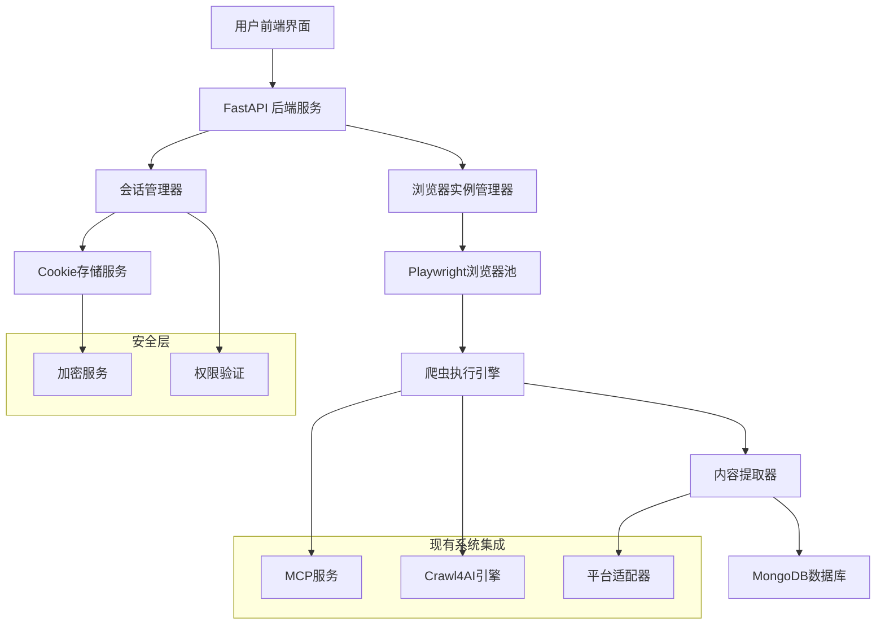
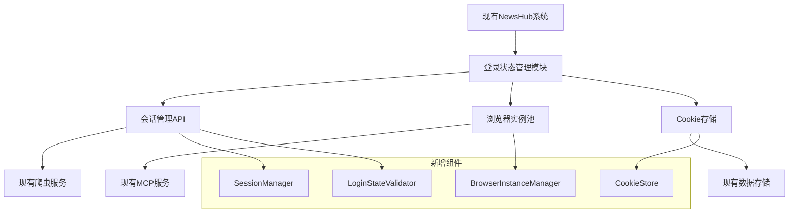
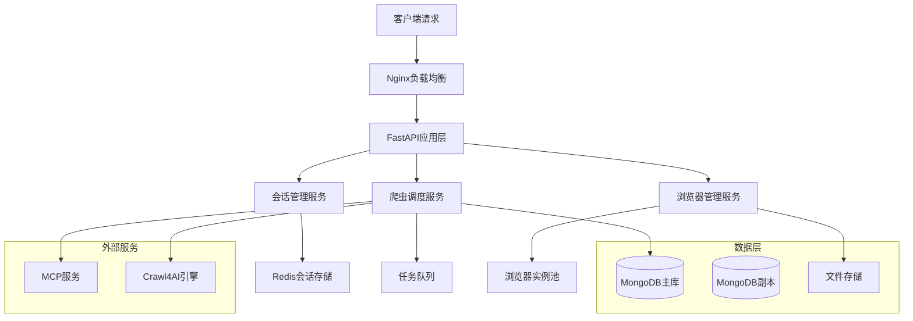
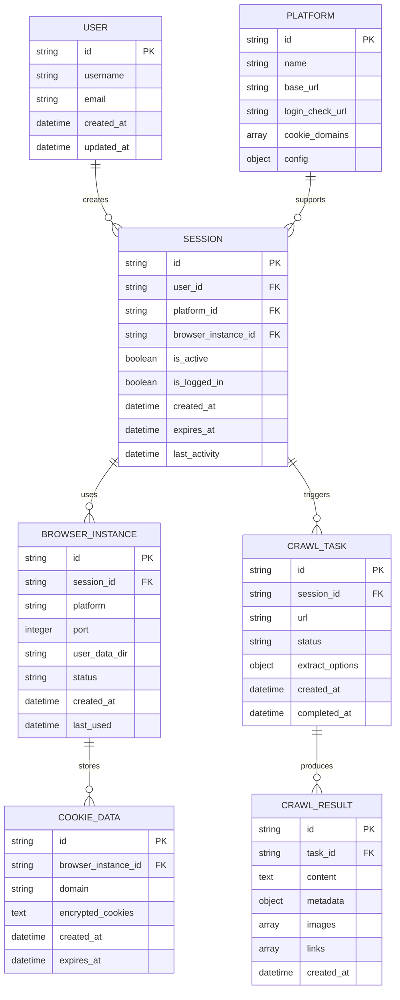

# NewsHub 登录状态管理技术架构文档

## 1. 架构设计

### 1.1 整体架构图



### 1.2 系统集成架构



## 2. 技术栈说明

### 2.1 核心技术

- **前端**: React + TypeScript (现有技术栈)
- **后端**: FastAPI + Python (扩展现有服务)
- **浏览器自动化**: Playwright (替代部分Crawl4AI功能)
- **数据库**: MongoDB (现有数据库)
- **缓存**: Redis (新增，用于会话管理)
- **加密**: cryptography库 (Cookie加密)
- **消息队列**: 现有系统或新增RabbitMQ

### 2.2 依赖包清单

```txt
# 新增依赖
playwright>=1.40.0
cryptography>=41.0.0
redis>=5.0.0
aioredis>=2.0.0
pydantic>=2.0.0
aiofiles>=23.0.0
psutil>=5.9.0

# 现有依赖（确保兼容）
fastapi>=0.104.0
mongodb>=4.0
crawl4ai>=0.3.0
```

## 3. 路由定义

### 3.1 新增API路由

| 路由 | 方法 | 功能描述 |
|------|------|----------|
| /api/session/create | POST | 创建新的登录会话 |
| /api/session/status | GET | 检查会话登录状态 |
| /api/session/validate | POST | 验证会话有效性 |
| /api/session/delete | DELETE | 删除会话 |
| /api/browser/instance | GET | 获取浏览器实例状态 |
| /api/browser/launch | POST | 启动新的浏览器实例 |
| /api/browser/close | DELETE | 关闭浏览器实例 |
| /api/crawl/manual | POST | 手动触发爬取 |
| /api/crawl/batch | POST | 批量爬取任务 |
| /api/crawl/status | GET | 查询爬取任务状态 |

### 3.2 现有路由扩展

| 路由 | 扩展功能 |
|------|----------|
| /api/crawler/extract | 支持使用已登录的浏览器实例 |
| /api/platforms/* | 集成登录状态检查 |

## 4. API定义

### 4.1 会话管理API

#### 创建会话
```
POST /api/session/create
```

请求参数:
| 参数名 | 类型 | 必需 | 描述 |
|--------|------|------|------|
| platform | string | true | 平台名称 (weibo, xiaohongshu, douyin) |
| user_id | string | true | 用户标识 |
| browser_config | object | false | 浏览器配置选项 |

响应:
| 参数名 | 类型 | 描述 |
|--------|------|------|
| session_id | string | 会话ID |
| browser_url | string | 浏览器访问URL |
| status | string | 创建状态 |
| expires_at | datetime | 会话过期时间 |

示例:
```json
{
  "platform": "weibo",
  "user_id": "user123",
  "browser_config": {
    "headless": false,
    "viewport": {"width": 1920, "height": 1080}
  }
}
```

#### 检查登录状态
```
GET /api/session/status/{session_id}
```

响应:
| 参数名 | 类型 | 描述 |
|--------|------|------|
| session_id | string | 会话ID |
| platform | string | 平台名称 |
| is_logged_in | boolean | 是否已登录 |
| login_user | string | 登录用户名 |
| last_check | datetime | 最后检查时间 |
| cookies_count | integer | Cookie数量 |

### 4.2 手动爬取API

#### 触发爬取
```
POST /api/crawl/manual
```

请求参数:
| 参数名 | 类型 | 必需 | 描述 |
|--------|------|------|------|
| url | string | true | 目标URL |
| session_id | string | true | 会话ID |
| extract_options | object | false | 提取选项 |
| save_to_db | boolean | false | 是否保存到数据库 |

响应:
| 参数名 | 类型 | 描述 |
|--------|------|------|
| task_id | string | 任务ID |
| status | string | 执行状态 |
| content | object | 提取的内容 |
| metadata | object | 元数据信息 |

示例:
```json
{
  "url": "https://weibo.com/u/1234567890",
  "session_id": "sess_abc123",
  "extract_options": {
    "extract_images": true,
    "extract_links": true,
    "max_posts": 10
  },
  "save_to_db": true
}
```

## 5. 服务器架构图



## 6. 数据模型

### 6.1 数据模型定义



### 6.2 数据定义语言 (DDL)

#### 会话表 (sessions)
```sql
-- MongoDB Collection: sessions
{
  "_id": ObjectId,
  "session_id": String, // 唯一会话标识
  "user_id": String,    // 用户ID
  "platform": String,   // 平台名称
  "browser_instance_id": String, // 浏览器实例ID
  "is_active": Boolean,  // 是否活跃
  "is_logged_in": Boolean, // 是否已登录
  "login_user": String,  // 登录用户名
  "created_at": ISODate,
  "expires_at": ISODate,
  "last_activity": ISODate,
  "metadata": {
    "user_agent": String,
    "ip_address": String,
    "browser_version": String
  }
}

-- 索引
db.sessions.createIndex({"session_id": 1}, {"unique": true})
db.sessions.createIndex({"user_id": 1, "platform": 1})
db.sessions.createIndex({"expires_at": 1})
db.sessions.createIndex({"last_activity": 1})
```

#### 浏览器实例表 (browser_instances)
```sql
-- MongoDB Collection: browser_instances
{
  "_id": ObjectId,
  "instance_id": String, // 实例ID
  "session_id": String,  // 关联会话ID
  "platform": String,    // 平台名称
  "port": Number,        // 调试端口
  "user_data_dir": String, // 用户数据目录
  "status": String,      // running, stopped, error
  "pid": Number,         // 进程ID
  "created_at": ISODate,
  "last_used": ISODate,
  "resource_usage": {
    "memory_mb": Number,
    "cpu_percent": Number
  },
  "config": {
    "headless": Boolean,
    "viewport": {
      "width": Number,
      "height": Number
    }
  }
}

-- 索引
db.browser_instances.createIndex({"instance_id": 1}, {"unique": true})
db.browser_instances.createIndex({"session_id": 1})
db.browser_instances.createIndex({"status": 1})
db.browser_instances.createIndex({"last_used": 1})
```

#### Cookie数据表 (cookie_data)
```sql
-- MongoDB Collection: cookie_data
{
  "_id": ObjectId,
  "browser_instance_id": String, // 浏览器实例ID
  "platform": String,    // 平台名称
  "domain": String,      // Cookie域名
  "encrypted_cookies": String, // 加密的Cookie数据
  "encryption_version": String, // 加密版本
  "created_at": ISODate,
  "updated_at": ISODate,
  "expires_at": ISODate
}

-- 索引
db.cookie_data.createIndex({"browser_instance_id": 1, "domain": 1})
db.cookie_data.createIndex({"platform": 1})
db.cookie_data.createIndex({"expires_at": 1})
```

#### 爬取任务表 (crawl_tasks)
```sql
-- MongoDB Collection: crawl_tasks
{
  "_id": ObjectId,
  "task_id": String,     // 任务ID
  "session_id": String,  // 会话ID
  "url": String,         // 目标URL
  "status": String,      // pending, running, completed, failed
  "extract_options": {
    "extract_images": Boolean,
    "extract_links": Boolean,
    "max_posts": Number,
    "custom_selectors": Object
  },
  "created_at": ISODate,
  "started_at": ISODate,
  "completed_at": ISODate,
  "error_message": String,
  "retry_count": Number,
  "priority": Number
}

-- 索引
db.crawl_tasks.createIndex({"task_id": 1}, {"unique": true})
db.crawl_tasks.createIndex({"session_id": 1})
db.crawl_tasks.createIndex({"status": 1})
db.crawl_tasks.createIndex({"created_at": -1})
```

#### 爬取结果表 (crawl_results)
```sql
-- MongoDB Collection: crawl_results
{
  "_id": ObjectId,
  "result_id": String,   // 结果ID
  "task_id": String,     // 任务ID
  "url": String,         // 原始URL
  "title": String,       // 页面标题
  "content": {
    "text": String,      // 文本内容
    "html": String,      // HTML内容
    "markdown": String   // Markdown格式
  },
  "metadata": {
    "author": String,
    "publish_time": ISODate,
    "platform": String,
    "post_id": String,
    "engagement": {
      "likes": Number,
      "comments": Number,
      "shares": Number
    }
  },
  "images": [{
    "url": String,
    "alt": String,
    "width": Number,
    "height": Number
  }],
  "links": [{
    "url": String,
    "text": String,
    "type": String
  }],
  "created_at": ISODate,
  "file_size": Number,
  "processing_time": Number
}

-- 索引
db.crawl_results.createIndex({"result_id": 1}, {"unique": true})
db.crawl_results.createIndex({"task_id": 1})
db.crawl_results.createIndex({"url": 1})
db.crawl_results.createIndex({"metadata.platform": 1})
db.crawl_results.createIndex({"created_at": -1})
```

#### 平台配置表 (platforms)
```sql
-- MongoDB Collection: platforms
{
  "_id": ObjectId,
  "platform_id": String, // 平台ID
  "name": String,        // 平台名称
  "display_name": String, // 显示名称
  "base_url": String,    // 基础URL
  "login_check_url": String, // 登录检查URL
  "cookie_domains": [String], // Cookie域名列表
  "config": {
    "requires_login": Boolean,
    "rate_limit": {
      "requests_per_minute": Number,
      "concurrent_requests": Number
    },
    "selectors": {
      "login_button": String,
      "user_info": String,
      "content_container": String
    },
    "headers": Object
  },
  "is_active": Boolean,
  "created_at": ISODate,
  "updated_at": ISODate
}

-- 索引
db.platforms.createIndex({"platform_id": 1}, {"unique": true})
db.platforms.createIndex({"name": 1}, {"unique": true})
db.platforms.createIndex({"is_active": 1})
```

### 6.3 初始化数据

```javascript
// 初始化平台配置
db.platforms.insertMany([
  {
    "platform_id": "weibo",
    "name": "weibo",
    "display_name": "微博",
    "base_url": "https://weibo.com",
    "login_check_url": "https://weibo.com/ajax/config",
    "cookie_domains": [".weibo.com", ".sina.com.cn"],
    "config": {
      "requires_login": true,
      "rate_limit": {
        "requests_per_minute": 30,
        "concurrent_requests": 3
      },
      "selectors": {
        "login_button": ".login-btn",
        "user_info": ".user-info",
        "content_container": ".feed-list"
      }
    },
    "is_active": true,
    "created_at": new Date(),
    "updated_at": new Date()
  },
  {
    "platform_id": "xiaohongshu",
    "name": "xiaohongshu",
    "display_name": "小红书",
    "base_url": "https://www.xiaohongshu.com",
    "login_check_url": "https://www.xiaohongshu.com/api/sns/web/v1/user/selfinfo",
    "cookie_domains": [".xiaohongshu.com"],
    "config": {
      "requires_login": true,
      "rate_limit": {
        "requests_per_minute": 20,
        "concurrent_requests": 2
      },
      "selectors": {
        "login_button": ".login-container",
        "user_info": ".user-container",
        "content_container": ".note-item"
      }
    },
    "is_active": true,
    "created_at": new Date(),
    "updated_at": new Date()
  },
  {
    "platform_id": "douyin",
    "name": "douyin",
    "display_name": "抖音",
    "base_url": "https://www.douyin.com",
    "login_check_url": "https://www.douyin.com/passport/web/get_qrcode/",
    "cookie_domains": [".douyin.com"],
    "config": {
      "requires_login": true,
      "rate_limit": {
        "requests_per_minute": 15,
        "concurrent_requests": 2
      },
      "selectors": {
        "login_button": ".login-mask",
        "user_info": ".user-info",
        "content_container": ".video-info"
      }
    },
    "is_active": true,
    "created_at": new Date(),
    "updated_at": new Date()
  }
]);
```

## 7. 核心组件实现

### 7.1 会话管理器

```python
# session_manager.py
import asyncio
import time
import uuid
from typing import Dict, Optional, List
from datetime import datetime, timedelta
import aioredis
from motor.motor_asyncio import AsyncIOMotorDatabase
from cryptography.fernet import Fernet

class SessionManager:
    def __init__(self, db: AsyncIOMotorDatabase, redis_client: aioredis.Redis):
        self.db = db
        self.redis = redis_client
        self.encryption_key = Fernet.generate_key()
        self.cipher = Fernet(self.encryption_key)
        self.active_sessions: Dict[str, dict] = {}
        
    async def create_session(self, user_id: str, platform: str, 
                           browser_config: dict = None) -> dict:
        """创建新的登录会话"""
        session_id = f"sess_{uuid.uuid4().hex[:12]}"
        expires_at = datetime.utcnow() + timedelta(hours=24)
        
        session_data = {
            "session_id": session_id,
            "user_id": user_id,
            "platform": platform,
            "is_active": True,
            "is_logged_in": False,
            "created_at": datetime.utcnow(),
            "expires_at": expires_at,
            "last_activity": datetime.utcnow(),
            "browser_config": browser_config or {}
        }
        
        # 保存到数据库
        await self.db.sessions.insert_one(session_data)
        
        # 缓存到Redis
        await self.redis.setex(
            f"session:{session_id}",
            86400,  # 24小时
            self.cipher.encrypt(str(session_data).encode())
        )
        
        self.active_sessions[session_id] = session_data
        return session_data
        
    async def validate_session(self, session_id: str) -> Optional[dict]:
        """验证会话有效性"""
        # 先从缓存获取
        cached_data = await self.redis.get(f"session:{session_id}")
        if cached_data:
            try:
                decrypted_data = self.cipher.decrypt(cached_data)
                session_data = eval(decrypted_data.decode())
                
                # 检查是否过期
                if datetime.fromisoformat(session_data['expires_at']) > datetime.utcnow():
                    return session_data
            except Exception:
                pass
                
        # 从数据库获取
        session_data = await self.db.sessions.find_one({"session_id": session_id})
        if session_data and session_data['expires_at'] > datetime.utcnow():
            return session_data
            
        return None
        
    async def update_login_status(self, session_id: str, is_logged_in: bool, 
                                login_user: str = None):
        """更新登录状态"""
        update_data = {
            "is_logged_in": is_logged_in,
            "last_activity": datetime.utcnow()
        }
        if login_user:
            update_data["login_user"] = login_user
            
        await self.db.sessions.update_one(
            {"session_id": session_id},
            {"$set": update_data}
        )
        
        # 更新缓存
        session_data = await self.validate_session(session_id)
        if session_data:
            session_data.update(update_data)
            await self.redis.setex(
                f"session:{session_id}",
                86400,
                self.cipher.encrypt(str(session_data).encode())
            )
```

### 7.2 浏览器实例管理器

```python
# browser_manager.py
import asyncio
import psutil
import shutil
from pathlib import Path
from playwright.async_api import async_playwright, Browser, BrowserContext
from typing import Dict, Optional

class BrowserInstanceManager:
    def __init__(self, max_instances: int = 5):
        self.max_instances = max_instances
        self.instances: Dict[str, dict] = {}
        self.playwright = None
        self.browser_type = None
        
    async def initialize(self):
        """初始化Playwright"""
        self.playwright = await async_playwright().start()
        self.browser_type = self.playwright.chromium
        
    async def create_instance(self, session_id: str, platform: str, 
                            config: dict = None) -> dict:
        """创建浏览器实例"""
        if len(self.instances) >= self.max_instances:
            await self._cleanup_oldest_instance()
            
        instance_id = f"browser_{session_id}"
        user_data_dir = f"./browser_data/{instance_id}"
        
        # 确保用户数据目录存在
        Path(user_data_dir).mkdir(parents=True, exist_ok=True)
        
        browser_config = {
            "headless": config.get("headless", False),
            "user_data_dir": user_data_dir,
            "args": [
                "--no-sandbox",
                "--disable-blink-features=AutomationControlled",
                "--disable-web-security",
                f"--remote-debugging-port={self._get_available_port()}"
            ]
        }
        
        browser = await self.browser_type.launch_persistent_context(
            user_data_dir=user_data_dir,
            **browser_config
        )
        
        instance_data = {
            "instance_id": instance_id,
            "session_id": session_id,
            "platform": platform,
            "browser": browser,
            "user_data_dir": user_data_dir,
            "status": "running",
            "created_at": datetime.utcnow(),
            "last_used": datetime.utcnow(),
            "config": config or {}
        }
        
        self.instances[instance_id] = instance_data
        return instance_data
        
    async def get_instance(self, session_id: str) -> Optional[dict]:
        """获取浏览器实例"""
        instance_id = f"browser_{session_id}"
        return self.instances.get(instance_id)
        
    async def close_instance(self, session_id: str):
        """关闭浏览器实例"""
        instance_id = f"browser_{session_id}"
        instance = self.instances.get(instance_id)
        
        if instance:
            try:
                await instance["browser"].close()
                # 清理用户数据目录
                shutil.rmtree(instance["user_data_dir"], ignore_errors=True)
            except Exception as e:
                print(f"Error closing browser instance: {e}")
            finally:
                del self.instances[instance_id]
                
    def _get_available_port(self) -> int:
        """获取可用端口"""
        import socket
        with socket.socket(socket.AF_INET, socket.SOCK_STREAM) as s:
            s.bind(('', 0))
            return s.getsockname()[1]
            
    async def _cleanup_oldest_instance(self):
        """清理最旧的实例"""
        if not self.instances:
            return
            
        oldest_instance = min(
            self.instances.values(),
            key=lambda x: x["last_used"]
        )
        await self.close_instance(oldest_instance["session_id"])
```

### 7.3 Cookie存储服务

```python
# cookie_store.py
import json
import aiofiles
from pathlib import Path
from cryptography.fernet import Fernet
from typing import List, Dict, Optional

class CookieStore:
    def __init__(self, encryption_key: bytes, storage_dir: str = "./data/cookies"):
        self.cipher = Fernet(encryption_key)
        self.storage_dir = Path(storage_dir)
        self.storage_dir.mkdir(parents=True, exist_ok=True)
        
    async def save_cookies(self, instance_id: str, platform: str, 
                          cookies: List[Dict]) -> bool:
        """保存加密的Cookie"""
        try:
            # 序列化Cookie数据
            cookie_data = {
                "platform": platform,
                "cookies": cookies,
                "timestamp": time.time()
            }
            
            # 加密数据
            encrypted_data = self.cipher.encrypt(
                json.dumps(cookie_data).encode()
            )
            
            # 保存到文件
            file_path = self.storage_dir / f"{instance_id}_cookies.enc"
            async with aiofiles.open(file_path, 'wb') as f:
                await f.write(encrypted_data)
                
            return True
        except Exception as e:
            print(f"Error saving cookies: {e}")
            return False
            
    async def load_cookies(self, instance_id: str) -> Optional[List[Dict]]:
        """加载并解密Cookie"""
        try:
            file_path = self.storage_dir / f"{instance_id}_cookies.enc"
            if not file_path.exists():
                return None
                
            async with aiofiles.open(file_path, 'rb') as f:
                encrypted_data = await f.read()
                
            # 解密数据
            decrypted_data = self.cipher.decrypt(encrypted_data)
            cookie_data = json.loads(decrypted_data.decode())
            
            return cookie_data.get("cookies", [])
        except Exception as e:
            print(f"Error loading cookies: {e}")
            return None
            
    async def delete_cookies(self, instance_id: str) -> bool:
        """删除Cookie文件"""
        try:
            file_path = self.storage_dir / f"{instance_id}_cookies.enc"
            if file_path.exists():
                file_path.unlink()
            return True
        except Exception as e:
            print(f"Error deleting cookies: {e}")
            return False
```

## 8. 集成现有系统

### 8.1 与现有爬虫服务集成

```python
# 扩展现有的main.py
from session_manager import SessionManager
from browser_manager import BrowserInstanceManager
from cookie_store import CookieStore

class EnhancedCrawlerService(CrawlerService):
    def __init__(self):
        super().__init__()
        self.session_manager = SessionManager(self.db, self.redis)
        self.browser_manager = BrowserInstanceManager()
        self.cookie_store = CookieStore(self.encryption_key)
        
    async def crawl_with_session(self, url: str, session_id: str, 
                               extract_options: dict = None) -> dict:
        """使用已登录会话进行爬取"""
        # 验证会话
        session = await self.session_manager.validate_session(session_id)
        if not session:
            raise ValueError("Invalid session")
            
        # 获取浏览器实例
        browser_instance = await self.browser_manager.get_instance(session_id)
        if not browser_instance:
            raise ValueError("Browser instance not found")
            
        # 使用浏览器实例进行爬取
        browser = browser_instance["browser"]
        page = await browser.new_page()
        
        try:
            await page.goto(url)
            await page.wait_for_load_state("networkidle")
            
            # 提取内容
            content = await self._extract_content(page, extract_options)
            
            # 保存结果
            result = await self._save_crawl_result(url, content, session_id)
            
            return result
        finally:
            await page.close()
```

### 8.2 API路由集成

```python
# 添加到现有的FastAPI应用
from fastapi import APIRouter, HTTPException, Depends
from pydantic import BaseModel

class SessionCreateRequest(BaseModel):
    platform: str
    user_id: str
    browser_config: dict = {}

class ManualCrawlRequest(BaseModel):
    url: str
    session_id: str
    extract_options: dict = {}
    save_to_db: bool = True

session_router = APIRouter(prefix="/api/session")
crawl_router = APIRouter(prefix="/api/crawl")

@session_router.post("/create")
async def create_session(request: SessionCreateRequest):
    try:
        session = await session_manager.create_session(
            request.user_id,
            request.platform,
            request.browser_config
        )
        
        # 创建浏览器实例
        browser_instance = await browser_manager.create_instance(
            session["session_id"],
            request.platform,
            request.browser_config
        )
        
        return {
            "session_id": session["session_id"],
            "browser_url": f"http://localhost:{browser_instance.get('port', 9222)}",
            "status": "created",
            "expires_at": session["expires_at"]
        }
    except Exception as e:
        raise HTTPException(status_code=500, detail=str(e))

@crawl_router.post("/manual")
async def manual_crawl(request: ManualCrawlRequest):
    try:
        result = await crawler_service.crawl_with_session(
            request.url,
            request.session_id,
            request.extract_options
        )
        
        return {
            "status": "success",
            "data": result,
            "timestamp": time.time()
        }
    except Exception as e:
        raise HTTPException(status_code=500, detail=str(e))

# 注册路由
app.include_router(session_router)
app.include_router(crawl_router)
```

## 9. 部署配置

### 9.1 Docker配置更新

```dockerfile
# 更新Dockerfile.crawler
FROM python:3.11-slim

# 安装系统依赖
RUN apt-get update && apt-get install -y \
    wget \
    gnupg \
    ca-certificates \
    fonts-liberation \
    libasound2 \
    libatk-bridge2.0-0 \
    libdrm2 \
    libxcomposite1 \
    libxdamage1 \
    libxrandr2 \
    libgbm1 \
    libxss1 \
    libu2f-udev \
    libvulkan1 \
    && rm -rf /var/lib/apt/lists/*

# 安装Python依赖
COPY requirements.txt .
RUN pip install -r requirements.txt

# 安装Playwright浏览器
RUN playwright install chromium

# 复制应用代码
COPY . /app
WORKDIR /app

# 创建必要目录
RUN mkdir -p /app/browser_data /app/data/cookies

# 设置权限
RUN chmod +x /app/start.sh

EXPOSE 8003
CMD ["python", "main.py"]
```

### 9.2 环境变量配置

```bash
# .env文件新增配置
# 会话管理配置
SESSION_TIMEOUT=3600
MAX_SESSIONS=10
SESSION_CLEANUP_INTERVAL=300

# 浏览器配置
MAX_BROWSER_INSTANCES=5
BROWSER_INSTANCE_TIMEOUT=1800
BROWSER_DATA_DIR=./browser_data

# 安全配置
ENCRYPTION_KEY_FILE=./keys/encryption.key
COOKIE_STORAGE_DIR=./data/cookies
ENABLE_AUDIT_LOG=true

# Redis配置（新增）
REDIS_HOST=localhost
REDIS_PORT=6379
REDIS_DB=1
REDIS_PASSWORD=
```

### 9.3 启动脚本更新

```powershell
# 更新start-all.ps1
# 添加Redis启动
Write-Host "[INFO] Starting Redis server..." -ForegroundColor Blue
Start-Process -FilePath "redis-server" -ArgumentList "--port 6379" -WindowStyle Hidden
Start-Sleep -Seconds 3

# 检查Redis状态
$redisStatus = Test-NetConnection -ComputerName localhost -Port 6379 -WarningAction SilentlyContinue
if ($redisStatus.TcpTestSucceeded) {
    Write-Host "[SUCCESS] Redis server started successfully" -ForegroundColor Green
} else {
    Write-Host "[ERROR] Failed to start Redis server" -ForegroundColor Red
    exit 1
}
```

## 10. 监控和维护

### 10.1 健康检查端点

```python
@app.get("/api/health/session")
async def session_health_check():
    """会话管理健康检查"""
    try:
        # 检查活跃会话数
        active_sessions = len(session_manager.active_sessions)
        
        # 检查浏览器实例数
        browser_instances = len(browser_manager.instances)
        
        # 检查Redis连接
        redis_status = await session_manager.redis.ping()
        
        return {
            "status": "healthy",
            "active_sessions": active_sessions,
            "browser_instances": browser_instances,
            "redis_connected": redis_status,
            "timestamp": time.time()
        }
    except Exception as e:
        return {
            "status": "unhealthy",
            "error": str(e),
            "timestamp": time.time()
        }
```

### 10.2 清理任务

```python
# 定期清理任务
import asyncio
from apscheduler.schedulers.asyncio import AsyncIOScheduler

scheduler = AsyncIOScheduler()

@scheduler.scheduled_job('interval', minutes=5)
async def cleanup_expired_sessions():
    """清理过期会话"""
    try:
        # 清理过期会话
        expired_sessions = await session_manager.cleanup_expired_sessions()
        
        # 清理对应的浏览器实例
        for session_id in expired_sessions:
            await browser_manager.close_instance(session_id)
            
        print(f"Cleaned up {len(expired_sessions)} expired sessions")
    except Exception as e:
        print(f"Error in cleanup task: {e}")

@scheduler.scheduled_job('interval', hours=1)
async def cleanup_browser_data():
    """清理浏览器数据"""
    try:
        # 清理无用的浏览器数据目录
        await browser_manager.cleanup_unused_data_dirs()
        
        # 清理过期的Cookie文件
        await cookie_store.cleanup_expired_cookies()
        
        print("Browser data cleanup completed")
    except Exception as e:
        print(f"Error in browser data cleanup: {e}")

# 启动调度器
scheduler.start()
```

这个技术架构文档提供了完整的实现方案，包括数据模型设计、核心组件实现、API接口定义和部署配置。通过这个架构，可以实现用户登录状态管理和手动触发爬取的功能，同时保证系统的安全性和可维护性。