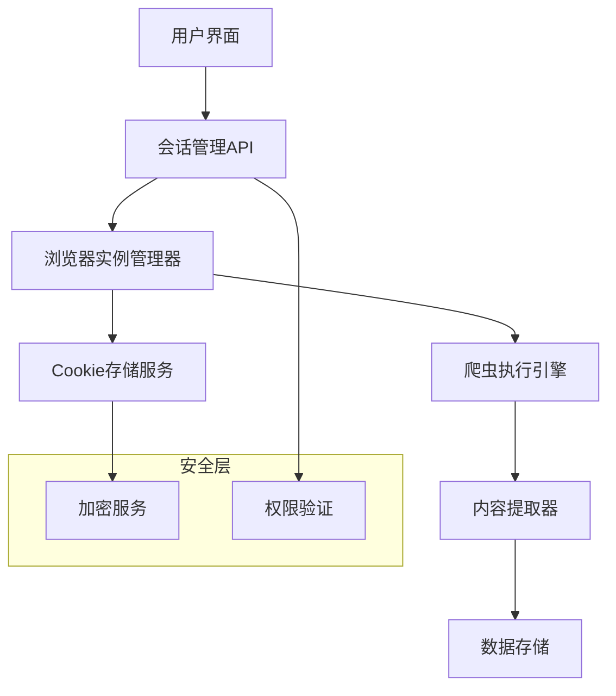

# NewsHub 登录状态管理爬虫功能设计文档

## 1. 功能概述

本文档设计了一个支持登录状态管理的爬虫功能，允许用户在第三方平台登录后保持会话状态，并手动触发对已登录网站的内容爬取。

### 1.1 核心需求
- 用户登录第三方平台后保持会话状态
- 手动触发爬取已登录网站的功能
- Cookie和会话管理的技术实现
- 浏览器实例复用和状态持久化
- 安全性和用户隐私保护

### 1.2 应用场景
- 微博、小红书等需要登录才能查看完整内容的平台
- 用户已在浏览器中登录，希望爬取特定页面内容
- 需要保持登录状态进行批量内容抓取

## 2. 核心功能模块

### 2.1 会话管理模块

#### 功能描述
管理用户在不同平台的登录状态，包括Cookie存储、会话持久化和状态验证。

#### 核心特性
- **Cookie存储**: 安全存储用户登录后的Cookie信息
- **会话验证**: 定期检查登录状态是否有效
- **多平台支持**: 支持微博、小红书、抖音等主流平台
- **状态同步**: 与浏览器实例保持登录状态同步

### 2.2 浏览器实例管理

#### 功能描述
管理可复用的浏览器实例，保持用户登录状态并支持手动触发爬取。

#### 核心特性
- **实例复用**: 维护长期运行的浏览器实例
- **状态持久化**: 保存浏览器的登录状态和Cookie
- **手动触发**: 提供API接口供用户主动触发爬取
- **资源管理**: 合理管理浏览器实例的生命周期

### 2.3 手动爬取触发器

#### 功能描述
提供用户友好的界面和API，允许用户在登录后手动触发特定页面的爬取。

#### 核心特性
- **URL验证**: 验证目标URL的有效性和安全性
- **权限检查**: 确认用户对目标平台的访问权限
- **实时反馈**: 提供爬取进度和结果的实时反馈
- **结果存储**: 将爬取结果存储到数据库中

## 3. 技术架构设计

### 3.1 整体架构



### 3.2 核心组件

#### 会话管理器 (SessionManager)
```python
class SessionManager:
    def __init__(self):
        self.sessions = {}  # 存储活跃会话
        self.cookie_store = CookieStore()  # Cookie存储
        
    async def create_session(self, platform: str, user_id: str):
        """创建新的会话"""
        pass
        
    async def validate_session(self, session_id: str):
        """验证会话有效性"""
        pass
        
    async def restore_session(self, session_id: str, browser_context):
        """恢复浏览器会话状态"""
        pass
```

#### 浏览器实例管理器 (BrowserInstanceManager)
```python
class BrowserInstanceManager:
    def __init__(self):
        self.instances = {}  # 浏览器实例池
        self.session_manager = SessionManager()
        
    async def get_or_create_instance(self, platform: str, session_id: str):
        """获取或创建浏览器实例"""
        pass
        
    async def maintain_login_state(self, instance_id: str):
        """维护登录状态"""
        pass
        
    async def cleanup_inactive_instances(self):
        """清理非活跃实例"""
        pass
```

## 4. 实现方案

### 4.1 Cookie和会话管理

#### Cookie存储策略
- **加密存储**: 使用AES加密存储敏感Cookie信息
- **分类管理**: 按平台分类存储Cookie
- **过期管理**: 自动清理过期的Cookie
- **备份恢复**: 支持Cookie的备份和恢复

#### 会话持久化
```python
class CookieStore:
    def __init__(self, encryption_key: str):
        self.encryption_key = encryption_key
        self.storage_path = "./data/cookies/"
        
    async def save_cookies(self, platform: str, cookies: list):
        """保存加密的Cookie"""
        encrypted_data = self.encrypt(cookies)
        file_path = f"{self.storage_path}/{platform}_cookies.enc"
        await self.write_file(file_path, encrypted_data)
        
    async def load_cookies(self, platform: str):
        """加载并解密Cookie"""
        file_path = f"{self.storage_path}/{platform}_cookies.enc"
        encrypted_data = await self.read_file(file_path)
        return self.decrypt(encrypted_data)
```

### 4.2 浏览器实例复用

#### 实例生命周期管理
- **启动策略**: 按需启动浏览器实例
- **保活机制**: 定期发送心跳保持实例活跃
- **资源监控**: 监控内存和CPU使用情况
- **自动清理**: 超时或资源不足时自动清理实例

#### 状态同步机制
```python
class BrowserInstance:
    def __init__(self, platform: str, session_id: str):
        self.platform = platform
        self.session_id = session_id
        self.browser = None
        self.context = None
        self.last_activity = time.time()
        
    async def initialize(self):
        """初始化浏览器实例"""
        self.browser = await playwright.chromium.launch(
            headless=False,  # 允许用户看到浏览器
            user_data_dir=f"./browser_data/{self.session_id}"
        )
        self.context = await self.browser.new_context()
        await self.restore_cookies()
        
    async def restore_cookies(self):
        """恢复Cookie状态"""
        cookies = await self.cookie_store.load_cookies(self.platform)
        if cookies:
            await self.context.add_cookies(cookies)
```

### 4.3 手动触发爬取

#### API接口设计
```python
from fastapi import APIRouter, HTTPException
from pydantic import BaseModel

class CrawlRequest(BaseModel):
    url: str
    platform: str
    session_id: str
    extract_options: dict = {}

router = APIRouter()

@router.post("/crawl/manual")
async def manual_crawl(request: CrawlRequest):
    """手动触发爬取"""
    try:
        # 验证会话
        session = await session_manager.validate_session(request.session_id)
        if not session:
            raise HTTPException(status_code=401, detail="会话无效")
            
        # 获取浏览器实例
        instance = await browser_manager.get_or_create_instance(
            request.platform, request.session_id
        )
        
        # 执行爬取
        result = await crawler.crawl_with_session(
            url=request.url,
            browser_instance=instance,
            extract_options=request.extract_options
        )
        
        return {
            "status": "success",
            "data": result,
            "timestamp": time.time()
        }
        
    except Exception as e:
        raise HTTPException(status_code=500, detail=str(e))
```

#### 前端触发界面
- **URL输入框**: 用户输入要爬取的页面URL
- **平台选择**: 选择目标平台（微博、小红书等）
- **登录状态显示**: 显示当前平台的登录状态
- **爬取按钮**: 触发爬取操作
- **进度显示**: 实时显示爬取进度
- **结果预览**: 显示爬取结果预览

## 5. 安全性和隐私保护

### 5.1 数据安全

#### Cookie加密
- **AES-256加密**: 使用强加密算法保护Cookie数据
- **密钥管理**: 安全的密钥生成和存储机制
- **定期轮换**: 定期更换加密密钥

#### 访问控制
- **用户认证**: 确保只有授权用户可以访问
- **会话验证**: 验证会话的有效性和归属
- **权限检查**: 检查用户对特定平台的访问权限

### 5.2 隐私保护

#### 数据最小化
- **按需存储**: 只存储必要的Cookie和会话信息
- **自动清理**: 定期清理过期和无用的数据
- **用户控制**: 允许用户删除自己的会话数据

#### 透明度
- **数据说明**: 明确告知用户存储了哪些数据
- **使用目的**: 说明数据的使用目的和范围
- **删除机制**: 提供数据删除的方法

### 5.3 合规性考虑

#### 平台条款
- **使用条款**: 确保爬取行为符合平台使用条款
- **频率限制**: 控制爬取频率避免对平台造成压力
- **内容使用**: 合理使用爬取的内容，尊重版权

#### 法律合规
- **数据保护**: 遵守相关数据保护法规
- **用户同意**: 获得用户明确同意
- **审计日志**: 记录关键操作用于审计

## 6. 部署和配置

### 6.1 环境要求

#### 系统要求
- **操作系统**: Linux/Windows/macOS
- **Python版本**: 3.8+
- **浏览器**: Chromium/Chrome
- **内存**: 建议4GB以上
- **存储**: 建议10GB以上可用空间

#### 依赖包
```txt
playwright>=1.40.0
fastapi>=0.104.0
cryptography>=41.0.0
aiofiles>=23.0.0
pydantic>=2.0.0
```

### 6.2 配置文件

```json
{
  "session_config": {
    "max_sessions": 10,
    "session_timeout": 3600,
    "cleanup_interval": 300
  },
  "browser_config": {
    "max_instances": 5,
    "instance_timeout": 1800,
    "headless": false,
    "user_data_dir": "./browser_data"
  },
  "security_config": {
    "encryption_key_file": "./keys/encryption.key",
    "cookie_storage_dir": "./data/cookies",
    "enable_audit_log": true
  },
  "platforms": {
    "weibo": {
      "base_url": "https://weibo.com",
      "login_check_url": "https://weibo.com/ajax/config",
      "cookie_domains": [".weibo.com", ".sina.com.cn"]
    },
    "xiaohongshu": {
      "base_url": "https://www.xiaohongshu.com",
      "login_check_url": "https://www.xiaohongshu.com/api/sns/web/v1/user/selfinfo",
      "cookie_domains": [".xiaohongshu.com"]
    }
  }
}
```

### 6.3 启动流程

1. **初始化加密密钥**
2. **启动会话管理服务**
3. **初始化浏览器实例池**
4. **启动API服务**
5. **注册清理任务**

## 7. 使用流程

### 7.1 用户登录流程

1. **打开浏览器实例**: 系统为用户分配一个浏览器实例
2. **用户手动登录**: 用户在浏览器中登录目标平台
3. **保存登录状态**: 系统自动保存Cookie和会话信息
4. **验证登录**: 系统验证登录状态是否成功
5. **状态持久化**: 将登录状态持久化存储

### 7.2 手动爬取流程

1. **选择平台**: 用户选择要爬取的平台
2. **检查登录状态**: 系统检查用户在该平台的登录状态
3. **输入目标URL**: 用户输入要爬取的页面URL
4. **配置爬取选项**: 设置内容提取选项
5. **执行爬取**: 系统使用已登录的浏览器实例执行爬取
6. **返回结果**: 显示爬取结果和内容预览

### 7.3 会话管理流程

1. **会话创建**: 为新用户创建会话
2. **状态监控**: 定期检查会话和登录状态
3. **自动续期**: 在会话即将过期时尝试续期
4. **异常处理**: 处理登录失效等异常情况
5. **资源清理**: 清理过期的会话和浏览器实例

## 8. 监控和维护

### 8.1 监控指标

- **会话数量**: 当前活跃会话数
- **浏览器实例**: 运行中的浏览器实例数
- **爬取成功率**: 爬取任务的成功率
- **响应时间**: API响应时间
- **资源使用**: CPU和内存使用情况
- **错误率**: 各类错误的发生率

### 8.2 日志记录

- **操作日志**: 记录用户的关键操作
- **错误日志**: 记录系统错误和异常
- **性能日志**: 记录性能相关指标
- **安全日志**: 记录安全相关事件

### 8.3 维护任务

- **定期清理**: 清理过期的会话和Cookie
- **性能优化**: 优化浏览器实例的使用
- **安全更新**: 更新加密密钥和安全配置
- **备份恢复**: 备份重要的会话数据

## 9. 扩展功能

### 9.1 批量爬取

- **任务队列**: 支持批量爬取任务的队列管理
- **并发控制**: 控制并发爬取的数量
- **进度跟踪**: 跟踪批量任务的执行进度
- **结果汇总**: 汇总批量爬取的结果

### 9.2 智能重试

- **失败检测**: 自动检测爬取失败的原因
- **重试策略**: 根据失败原因选择重试策略
- **登录恢复**: 自动恢复失效的登录状态
- **降级处理**: 在无法恢复时提供降级方案

### 9.3 内容分析

- **内容去重**: 自动去除重复的内容
- **质量评估**: 评估爬取内容的质量
- **分类标记**: 自动分类和标记内容
- **趋势分析**: 分析内容的趋势和热点

## 10. 总结

本设计文档提供了一个完整的登录状态管理爬虫功能方案，支持用户在第三方平台登录后保持会话状态，并手动触发对已登录网站的内容爬取。该方案在技术实现、安全性、用户体验等方面都进行了充分考虑，为NewsHub爬虫服务提供了强大的扩展能力。

通过实施这个方案，用户可以：
- 轻松管理多个平台的登录状态
- 手动触发对需要登录的网站进行爬取
- 享受安全可靠的会话管理服务
- 获得良好的用户体验和操作便利性

该功能的实现将显著提升NewsHub爬虫服务的实用性和竞争力，为用户提供更加全面和便捷的内容爬取解决方案。