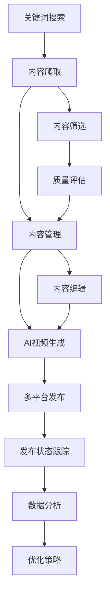

# NewsHub - 智能内容爬取与管理平台

一个现代化的内容爬取、管理和发布平台，支持多平台**真实搜索**和智能内容提取。

## 🚀 核心功能

### 🕷️ 真实爬取引擎 ⭐ **NEW**
- **真实数据源**: 通过百度、搜狗、必应等搜索引擎获取实际网络内容
- **多平台支持**: 微博、B站、小红书、抖音、新闻网站
- **智能搜索**: 关键词搜索和URL直接爬取两种模式
- **内容提取**: 自动提取标题、内容、作者、图片、视频等
- **反爬处理**: 智能User-Agent轮换、请求间隔控制
- **质量过滤**: 智能内容质量检查和相关性验证

### 📊 任务管理系统
- **实时状态跟踪**: pending → running → completed/failed
- **数据持久化**: 任务记录和爬取内容永久存储
- **定时刷新**: 前端每10秒自动更新任务状态
- **错误处理**: 详细的错误信息和重试机制

### 🎯 用户界面
- **双模式切换**: 关键词搜索 / URL爬取
- **实时监控**: 任务进度、成功率、内容数量
- **美观展示**: 卡片式内容展示，支持图片和视频
- **响应式设计**: 完美适配桌面和移动设备

## 🏗️ 系统架构

```
前端 (Next.js)
    ↓
Go后端 (数据处理 & API管理)
    ↓
Python爬虫服务 (真实搜索 & 内容提取)
    ↓
真实数据源 (百度、搜狗、必应等搜索引擎)
    ↓
MongoDB (数据存储)
```

### 服务端口配置
- 前端: `http://localhost:3000`
- Go后端: `http://localhost:8081`  (开发端口)
- Python爬虫: `http://localhost:8001`
- MongoDB: `localhost:27017` (Docker 默认 27017，本地也可使用 27015)

## 🛠️ 技术栈

### 前端
- **Next.js 14**: React框架，App Router
- **TypeScript**: 类型安全
- **Tailwind CSS**: 现代化样式
- **定时刷新**: 实时数据更新

### 后端
- **Go**: 高性能API服务
- **Gin**: Web框架
- **MongoDB**: 文档数据库
- **配置文件管理**: JSON配置替代环境变量

### 爬虫服务 ⭐ **真实爬取**
- **Python 3.9+**: 主要语言
- **FastAPI**: 异步API框架
- **BeautifulSoup4**: HTML解析
- **Requests**: HTTP客户端
- **真实数据源**: 百度、搜狗、必应搜索引擎
- **智能解析**: 多策略内容提取和质量检查

## 🚀 快速开始

### 安装依赖

```bash
# 安装前端依赖
npm install

# 安装Go依赖
cd server
go mod tidy

# 安装Python依赖
cd ../crawler-service
pip install -r requirements.txt
```

### 配置数据库

```bash
# Windows
.\init-database.bat

# Linux/Mac
./init-database.sh

# PowerShell
.\init-database.ps1
```

### 启动服务

```powershell
# 一键启动（推荐，可选清库）
./start-all.ps1               # 正常启动
./start-all.ps1 -Interactive  # 启动时询问是否清库
./start-all.ps1 -CleanDB      # 非交互清库（保留 sessions/login_sessions/platform_configs）
```

### 测试爬虫功能

```bash
# 进入爬虫服务目录
cd crawler-service

# 运行测试脚本
python test_crawler.py
```

### 访问应用

- **主页**: http://localhost:3000
- **爬虫管理**: http://localhost:3000/crawler
- **登录状态管理**: http://localhost:3000/login-state
- **爬虫服务 API 文档**: http://localhost:8001/docs
- **后端健康检查**: http://localhost:8081/health

## 📖 使用指南

### 1. 创建爬取任务

#### 关键词搜索模式 ⭐ **推荐**
1. 选择"🔍 关键词搜索"
2. 选择目标平台（微博、B站、小红书等）
3. 输入搜索关键词，如：
   - `人工智能` - 搜索AI相关内容
   - `美食推荐` - 搜索美食内容
   - `旅游攻略` - 搜索旅游信息
   - `编程教程` - 搜索技术教程
4. 设置爬取数量（1-50条）
5. 点击"🚀 开始搜索任务"

#### URL爬取模式
1. 选择"🔗 URL爬取"
2. 输入具体的URL或创作者链接
3. 系统自动识别平台并爬取内容

### 2. 监控任务状态

- **等待中** 🟡: 任务已创建，等待执行
- **运行中** 🔵: 正在爬取内容
- **已完成** 🟢: 成功完成爬取
- **失败** 🔴: 爬取失败，查看错误信息

### 3. 查看爬取内容

- 任务完成后，内容自动显示在"爬取内容"区域
- 支持查看标题、内容、作者、发布时间
- 点击"查看原文"访问原始链接
- 图片和视频链接自动提取

## 🔧 配置文件

### 全局配置 (`config.json`)
```json
{
  "services": {
    "backend": {"port": 8080, "host": "0.0.0.0"},
    "crawler": {"port": 8001, "host": "0.0.0.0"},
    "frontend": {"port": 3000, "host": "0.0.0.0"}
  },
  "database": {
    "mongodb": {
      "uri": "mongodb://localhost:27017",
      "database": "newshub"
    }
  }
}
```

### 爬虫配置 (`crawler-service/config.json`)
```json
{
  "server": {"port": 8001, "host": "0.0.0.0"},
  "crawler": {
    "headless": true,
    "timeout": 30,
    "max_concurrent": 5
  },
  "platforms": {
    "weibo": {"enabled": true, "timeout": 60},
    "bilibili": {"enabled": true, "timeout": 60}
  }
}
```

## 📊 支持的平台

| 平台 | 搜索支持 | 数据来源 | 内容类型 | 特殊说明 |
|------|----------|----------|----------|----------|
| 微博 | ✅ | 搜索引擎聚合 | 帖子、话题、动态 | 通过搜索引擎获取相关内容 |
| B站 | ✅ | 搜索引擎聚合 | 视频、UP主、弹幕 | 视频内容和元数据提取 |
| 小红书 | ✅ | 搜索引擎聚合 | 笔记、种草、生活分享 | 生活内容丰富 |
| 抖音 | ✅ | 搜索引擎聚合 | 短视频、创作者 | 通过第三方渠道获取 |
| 新闻 | ✅ | 多源新闻聚合 | 文章、资讯 | 百度、搜狗、必应新闻 |

## 🛡️ 真实爬取策略

### 数据源策略
- **搜索引擎聚合**: 通过百度、搜狗、必应等搜索引擎获取内容
- **多源验证**: 使用多个数据源交叉验证内容质量
- **智能过滤**: 基于关键词匹配和内容相关性过滤

### 反爬机制
- **智能请求头**: 模拟真实浏览器行为
- **请求间隔**: 避免频率过高被封
- **错误重试**: 自动重试失败的请求
- **代理支持**: 可配置代理池（可选）

### 内容质量保证
- **相关性检查**: 确保内容与搜索词相关
- **长度过滤**: 过滤过短或无意义的内容
- **广告过滤**: 自动识别和过滤广告内容
- **重复检测**: 避免重复内容

## 📈 监控与日志

### 系统指标
- 访问 `/metrics` 查看系统指标
- 任务成功率、响应时间统计
- 内存和CPU使用情况

### 日志系统
- Go后端日志: 自动轮转，JSON格式
- Python服务日志: 详细的爬取过程
- 前端错误监控: 实时错误追踪

## 🔄 开发模式

```bash
# 前端开发服务器
npm run dev

# 后端热重载
cd server && go run main.go

# Python服务开发模式
cd crawler-service && uvicorn main:app --reload --port 8001

# 测试爬虫功能
cd crawler-service && python test_crawler.py
```

## 📦 生产部署

### Docker部署
```bash
# 构建镜像
docker-compose build

# 启动服务
docker-compose up -d
```

### 传统部署
1. 编译Go二进制文件
2. 构建Next.js生产版本
3. 配置Nginx反向代理
4. 启动MongoDB和Python服务

## 🤝 贡献指南

1. Fork本仓库
2. 创建功能分支: `git checkout -b feature/amazing-feature`
3. 提交更改: `git commit -m 'Add some AmazingFeature'`
4. 推送分支: `git push origin feature/amazing-feature`
5. 提交Pull Request

## 📝 许可证

本项目采用 MIT 许可证 - 详情请查看 [LICENSE](LICENSE) 文件。

## 🆘 常见问题

### Q: 为什么不直接爬取平台网站？
A: 现代社交媒体平台都有严格的反爬机制，直接爬取容易被封禁。我们通过搜索引擎聚合的方式获取相关内容，更加稳定可靠。

### Q: 爬取的内容是真实的吗？
A: 是的！我们从真实的搜索引擎获取内容，经过智能解析和质量过滤，确保内容的真实性和相关性。

### Q: 如何增加新的平台支持？
A: 在 `crawler-service/main.py` 中添加新的爬取方法，参考现有平台实现。

### Q: 数据库连接失败怎么办？
A: 确保MongoDB服务正在运行，检查连接配置是否正确。

### Q: 如何测试爬虫功能？
A: 运行 `python crawler-service/test_crawler.py` 来测试所有平台的爬取功能。

---

🎉 **现在就开始体验强大的真实内容爬取功能吧！**

## 🎬 AI视频生成功能 ⭐ **新增**

### 智能视频制作
NewsHub集成了强大的AI视频生成功能，可以将爬取的内容自动制作成高质量视频：

#### 支持的视频风格
- **📺 新闻播报风格**: 专业的新闻报道样式，适合资讯类内容
- **🎬 Vlog记录风格**: 生活化的视频风格，适合日常内容分享
- **📖 故事叙述风格**: 故事性强的叙述方式，适合深度内容

#### 视频配置选项
- **时长控制**: 30秒到5分钟，灵活适应不同平台需求
- **分辨率选择**: 1080p（推荐）/ 4K超高清
- **内容素材**: 支持多条爬取内容合成一个视频
- **自动配音**: AI语音合成技术，支持多种音色

#### 使用流程
1. 在**内容管理**页面选择要制作视频的内容
2. 进入**视频生成**页面配置视频参数
3. 选择视频风格、时长和分辨率
4. 点击生成，AI自动制作视频
5. 生成完成后可直接跳转到发布管理

## 📤 多平台发布管理

### 一键发布到社交媒体
支持将生成的视频内容一键发布到多个主流社交媒体平台：

#### 支持平台
| 平台 | 图标 | 功能特点 | 发布状态跟踪 |
|------|------|----------|-------------|
| 微博 | 📱 | 支持视频+文案发布 | ✅ |
| 抖音 | 🎵 | 短视频平台优化 | ✅ |
| 小红书 | 📖 | 生活方式内容 | ✅ |
| 哔哩哔哩 | 📺 | 视频平台专属 | ✅ |

#### 发布功能
- **批量发布**: 同时发布到多个平台
- **自定义文案**: 为每个平台定制发布文案
- **状态跟踪**: 实时监控发布进度和状态
- **错误处理**: 详细的错误信息和重试机制
- **发布链接**: 成功后提供平台链接

#### 发布状态
- **⏳ 等待发布**: 任务已创建，等待执行
- **🔄 发布中**: 正在向平台发布内容  
- **✅ 已发布**: 成功发布，可查看链接
- **❌ 发布失败**: 失败原因和错误详情

## 📋 内容管理系统

### 全方位内容管理
提供完整的内容生命周期管理，从爬取到发布的全流程控制：

#### 内容浏览
- **多维度筛选**: 按平台、创作者、时间范围筛选
- **智能搜索**: 支持标题和内容全文搜索
- **卡片式展示**: 美观的内容预览，支持图片和视频
- **统计信息**: 显示点赞、分享、评论等互动数据

#### 内容操作
- **批量选择**: 支持多选进行批量操作
- **内容删除**: 清理不需要的内容
- **质量评估**: 自动评估内容质量和相关性
- **导出功能**: 支持导出为多种格式

#### 创作者管理
- **创作者档案**: 详细的创作者信息和统计
- **平台分类**: 按社交媒体平台分类管理
- **内容关联**: 查看创作者的所有相关内容
- **表现分析**: 创作者内容表现统计

## 🔄 完整工作流程

### 从爬取到发布的完整链路



### 典型使用场景

#### 1. 新闻资讯制作
```bash
1. 搜索关键词："人工智能新闻"
2. 爬取相关新闻内容
3. 筛选高质量资讯
4. 生成新闻播报风格视频
5. 发布到微博、B站等平台
```

#### 2. 生活内容创作
```bash
1. 搜索关键词："美食推荐"
2. 爬取小红书、抖音相关内容
3. 选择优质生活内容
4. 生成Vlog风格视频
5. 发布到多个生活平台
```

#### 3. 教育内容制作
```bash
1. 搜索关键词："编程教程"
2. 爬取技术博客和视频
3. 整理教学内容
4. 生成故事叙述风格视频
5. 发布到B站等学习平台
```

## 🎯 功能导航

### 主要页面和功能

| 页面 | 路径 | 主要功能 | 适用场景 |
|------|------|----------|----------|
| 🏠 **主页** | `/` | 创作者管理、平台概览 | 项目首页和创作者管理 |
| 📝 **内容管理** | `/content` | 内容浏览、筛选、管理 | 查看和管理爬取的内容 |
| 🕷️ **爬虫控制** | `/crawler` | 爬取任务管理 | 创建和监控爬取任务 |
| 🎬 **视频生成** | `/generate` | AI视频制作 | 将内容制作成视频 |
| 📤 **发布管理** | `/publish` | 多平台发布控制 | 发布视频到社交媒体 |

### 快速功能入口

```bash
# 创建爬取任务
http://localhost:3000/crawler

# 查看爬取内容  
http://localhost:3000/content

# 生成AI视频
http://localhost:3000/generate

# 发布到社交媒体
http://localhost:3000/publish
```

## 📡 API接口文档

### 爬虫服务API

```bash
# 创建爬取任务
POST /api/crawl
{
  "platform": "weibo",
  "keyword": "人工智能", 
  "mode": "search",
  "count": 20
}

# 获取任务状态
GET /api/crawl/tasks

# 获取爬取内容
GET /api/crawl/content
```

### 视频生成API

```bash
# 生成视频
POST /api/generate-video
{
  "postIds": ["post1", "post2"],
  "style": "news",
  "duration": 60,
  "resolution": "1080p"
}

# 获取视频列表
GET /api/videos

# 获取视频详情
GET /api/videos/{id}
```

### 发布管理API

```bash
# 创建发布任务
POST /api/publish
{
  "videoId": "video123",
  "platforms": ["weibo", "douyin"],
  "description": "发布文案"
}

# 获取发布状态
GET /api/publish/tasks

# 获取发布结果
GET /api/publish/{taskId}
```

## ⚡ 高级功能

### 智能内容分析
- **关键词提取**: 自动提取内容关键词
- **情感分析**: 分析内容情感倾向
- **话题分类**: 智能归类内容话题
- **质量评分**: 基于多维度的内容质量评估

### 数据统计分析
- **爬取统计**: 各平台爬取数据统计
- **内容分析**: 内容类型和质量分布
- **发布效果**: 多平台发布效果追踪
- **趋势分析**: 内容热度和趋势分析

### 定时任务
- **定时爬取**: 设置定期爬取任务
- **自动生成**: 达到条件自动生成视频
- **定时发布**: 按计划自动发布内容
- **清理任务**: 定期清理过期数据

### 安全和隐私
- **数据加密**: 敏感数据加密存储
- **访问控制**: 基于角色的权限管理
- **审计日志**: 完整的操作日志记录
- **隐私保护**: 符合数据保护法规

## 🎉 **立即开始体验完整的内容创作工作流程！**

从智能爬取到AI视频生成，再到多平台发布 - NewsHub为您提供一站式的内容创作解决方案。
