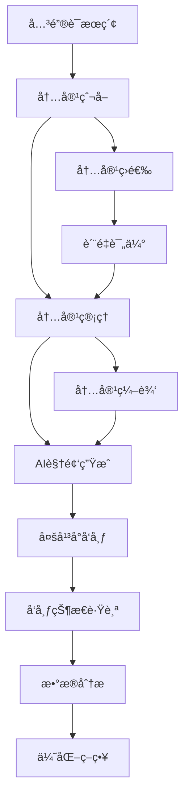
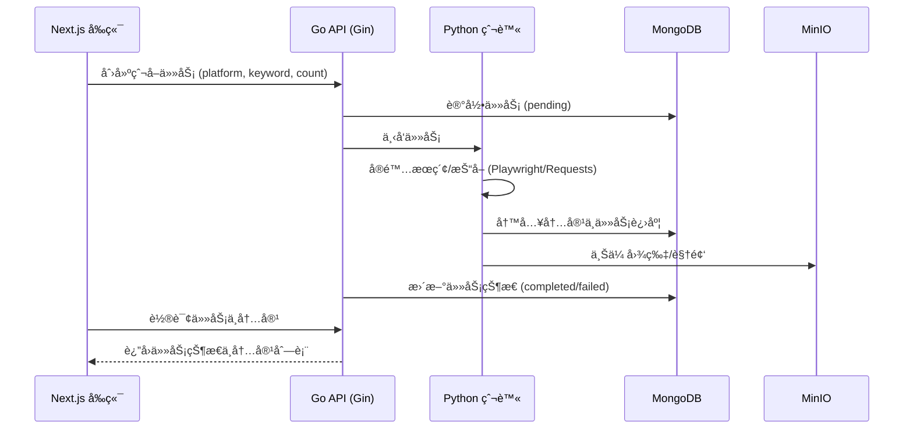
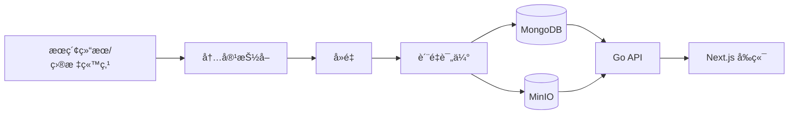

# NewsHub - 智能内容爬å–ä¸ç®¡ç†å¹³å°

一个ç°ä»£åŒ–的内容爬å–ã€ç®¡ç†å’Œå‘布平å°ï¼Œæ”¯æŒå¤šå¹³å°**真å®æœç´¢**和智能内容æå–。

## 🚀 核心功能

### ğŸ•·ï¸ çœŸå®çˆ¬å–å¼•æ“ â­ **NEW**
- **真å®æ•°æ®æº**: 通过百度ã€æœç‹—ã€å¿…应等æœç´¢å¼•æ“è·å–å®é™…网络内容
- **多平å°æ”¯æŒ**: å¾®åšã€Bç«™ã€å°çº¢ä¹¦ã€æŠ–音ã€æ–°é—»ç½‘ç«™
- **智能æœç´¢**: 关键è¯æœç´¢å’ŒURLç›´æ¥çˆ¬å–两ç§æ¨¡å¼
- **内容æå–**: 自动æå–标题ã€å†…容ã€ä½œè€…ã€å›¾ç‰‡ã€è§†é¢‘ç­‰
- **å爬处ç†**: 智能User-Agentè½®æ¢ã€è¯·æ±‚é—´éš”æ§åˆ¶
- **è´¨é‡è¿‡æ»¤**: 智能内容质é‡æ£€æŸ¥å’Œç›¸å…³æ€§éªŒè¯

### 📊 任务管ç†ç³»ç»Ÿ
- **å®æ—¶çŠ¶æ€è·Ÿè¸ª**: pending → running → completed/failed
- **æ•°æ®æŒä¹…化**: 任务记录和爬å–内容永久存储
- **定时刷新**: å‰ç«¯æ¯10秒自动更新任务状æ€
- **错误处ç†**: 详细的错误信æ¯å’Œé‡è¯•æœºåˆ¶

### 🯠用户界é¢
- **åŒæ¨¡å¼åˆ‡æ¢**: 关键è¯æœç´¢ / URL爬å–
- **å®æ—¶ç›‘æ§**: 任务进度ã€æˆåŠŸç‡ã€å†…容数é‡
- **ç¾è§‚展示**: å¡ç‰‡å¼å†…容展示，支æŒå›¾ç‰‡å’Œè§†é¢‘
- **å“应å¼è®¾è®¡**: 完ç¾é€‚é…æ¡Œé¢å’Œç§»åŠ¨è®¾å¤‡

## ğŸ—ï¸ ç³»ç»Ÿæ¶æ„

```mermaid
graph LR
    A[Next.js 14 å‰ç«¯] -- REST/JSON --> B[Go API (Gin)]
    B -- 任务下å‘/å›è°ƒ --> C[Python 爬虫æœåŠ¡ (FastAPI/Playwright)]
    C -- 真å®æœç´¢/æŠ“å– --> G[(æœç´¢å¼•æ“/目标站点)]
    B -- 元数æ®/çŠ¶æ€ --> D[(MongoDB)]
    B -- 媒体读写 --> E[(MinIO 对象存储)]
    subgraph å端内部
        B --- F[任务调度器/é‡è¯•]
        B --- H[å»é‡ä¸è´¨é‡è¯„ä¼°]
    end
    style D fill:#E3F2FD,stroke:#90CAF9
    style E fill:#F1F8E9,stroke:#A5D6A7
```

### æœåŠ¡ç«¯å£é…ç½®
- å‰ç«¯: `http://localhost:3000`
- Goå端: `http://localhost:8081`（本地开å‘ï¼›Docker 为 `8080`）
- Python爬虫: `http://localhost:8001`
- MinIO: `9000`(API) / `9001`(Console)
- MongoDB: `localhost:27015`（本地），Docker 默认 `27017`

### 部署拓扑

```mermaid
graph TB
    subgraph Client
        U[Browser/Creator]
    end

    subgraph Host/Dev Machine
        FE[Next.js Frontend :3000]
        BE[Go Backend (Gin) :8081]
        PY[Python Crawler :8001]
        DB[(MongoDB :27015/27017)]
        OBJ[(MinIO :9000/:9001)]
    end

    U --> FE --> BE --> PY
    BE <---> DB
    BE <---> OBJ
    PY --> DB
    PY --> OBJ
```

### 端å£ä¸æœåŠ¡ä¸€è§ˆ

| æœåŠ¡ | ç«¯å£ | æè¿° | 备注 |
|------|------|------|------|
| å‰ç«¯ Next.js | 3000 | Web 应用 | å¼€å‘ç¯å¢ƒ
| Go å端 | 8081 | API æœåŠ¡ | Docker 默认 8080
| Python 爬虫 | 8001 | 爬虫/抽å–æœåŠ¡ | FastAPI + Playwright
| MinIO API | 9000 | 对象存储 API | 媒体ä¸æ–‡ä»¶
| MinIO Console | 9001 | MinIO æ§åˆ¶å° | Web 管ç†ç•Œé¢
| MongoDB | 27015/27017 | 文档数æ®åº“ | 本地 27015，Docker 27017

### ç¯å¢ƒå˜é‡ï¼ˆ.env.local 示例）

```bash
# æ•°æ®åº“
MONGODB_URI=mongodb://localhost:27015
DB_NAME=newshub

# MinIO 对象存储
MINIO_ENDPOINT=localhost:9000
MINIO_ACCESS_KEY=minioadmin
MINIO_SECRET_KEY=minioadmin123
MINIO_USE_SSL=false
MINIO_BUCKET_NAME=newshub-media

# æœåŠ¡ç«¯å£
PORT=8081
CRAWLER_SERVICE_URL=http://localhost:8001
```

## ğŸ› ï¸ æŠ€æœ¯æ ˆ

### å‰ç«¯
- **Next.js 14**: React框æ¶ï¼ŒApp Router
- **TypeScript**: ç±»å‹å®‰å…¨
- **Tailwind CSS**: ç°ä»£åŒ–æ ·å¼
- **定时刷新**: å®æ—¶æ•°æ®æ›´æ–°

### å端
- **Go**: 高性能APIæœåŠ¡
- **Gin**: Web框æ¶
- **MongoDB**: 文档数æ®åº“
- **é…置文件管ç†**: JSONé…置替代ç¯å¢ƒå˜é‡

### 爬虫æœåŠ¡ â­ **真å®çˆ¬å–**
- **Python 3.9+**: 主è¦è¯­è¨€
- **FastAPI**: 异步API框æ¶
- **BeautifulSoup4**: HTML解æ
- **Requests**: HTTP客户端
- **真å®æ•°æ®æº**: 百度ã€æœç‹—ã€å¿…应æœç´¢å¼•æ“
- **智能解æ**: 多策略内容æå–和质é‡æ£€æŸ¥

## 🚀 快速开始

### 安装ä¾èµ–

```bash
# 安装å‰ç«¯ä¾èµ–
npm install

# 安装Goä¾èµ–
cd server
go mod tidy

# 安装Pythonä¾èµ–
cd ../crawler-service
pip install -r requirements.txt
```

### é…置数æ®åº“

```bash
# Windows
.\init-database.bat

# Linux/Mac
./init-database.sh

# PowerShell
.\init-database.ps1
```

### å¯åŠ¨æœåŠ¡

```powershell
# 一键å¯åŠ¨ï¼ˆæ¨è，å¯é€‰æ¸…库）
./start-all.ps1               # 正常å¯åŠ¨
./start-all.ps1 -Interactive  # å¯åŠ¨æ—¶è¯¢é—®æ˜¯å¦æ¸…库
./start-all.ps1 -CleanDB      # é交互清库（ä¿ç•™ sessions/login_sessions/platform_configs）
```

### 测试爬虫功能

```bash
# 进入爬虫æœåŠ¡ç›®å½•
cd crawler-service

# è¿è¡Œæµ‹è¯•è„šæœ¬
python test_crawler.py
```

### 访问应用

- **主页**: http://localhost:3000
- **爬虫管ç†**: http://localhost:3000/crawler
- **登录状æ€ç®¡ç†**: http://localhost:3000/login-state
- **爬虫æœåŠ¡ API 文档**: http://localhost:8001/docs
- **å端å¥åº·æ£€æŸ¥**: http://localhost:8081/health

## 📖 使用指å—

### 1. 创建爬å–任务

#### 关键è¯æœç´¢æ¨¡å¼ â­ **æ¨è**
1. 选择"🔠关键è¯æœç´¢"
2. 选择目标平å°ï¼ˆå¾®åšã€Bç«™ã€å°çº¢ä¹¦ç­‰ï¼‰
3. 输入æœç´¢å…³é”®è¯ï¼Œå¦‚：
   - `人工智能` - æœç´¢AI相关内容
   - `ç¾é£Ÿæ¨è` - æœç´¢ç¾é£Ÿå†…容
   - `旅游攻略` - æœç´¢æ—…游信æ¯
   - `编程教程` - æœç´¢æŠ€æœ¯æ•™ç¨‹
4. 设置爬å–æ•°é‡ï¼ˆ1-50æ¡ï¼‰
5. 点击"🚀 开始æœç´¢ä»»åŠ¡"

#### URL爬å–模å¼
1. 选择"🔗 URL爬å–"
2. 输入具体的URL或创作者链æ¥
3. 系统自动识别平å°å¹¶çˆ¬å–内容

### 2. 监æ§ä»»åŠ¡çŠ¶æ€

- **等待中** 🟡: 任务已创建，等待执行
- **è¿è¡Œä¸­** 🔵: 正在爬å–内容
- **已完æˆ** 🟢: æˆåŠŸå®Œæˆçˆ¬å–
- **失败** 🔴: 爬å–失败，查看错误信æ¯

### 3. 查看爬å–内容

- 任务完æˆå，内容自动显示在"爬å–内容"区域
- 支æŒæŸ¥çœ‹æ ‡é¢˜ã€å†…容ã€ä½œè€…ã€å‘布时间
- 点击"查看åŸæ–‡"访问åŸå§‹é“¾æ¥
- 图片和视频链æ¥è‡ªåŠ¨æå–

## 🔧 é…置文件

### 全局é…ç½® (`config.json`)
```json
{
  "services": {
    "backend": {"port": 8080, "host": "0.0.0.0"},
    "crawler": {"port": 8001, "host": "0.0.0.0"},
    "frontend": {"port": 3000, "host": "0.0.0.0"}
  },
  "database": {
    "mongodb": {
      "uri": "mongodb://localhost:27017",
      "database": "newshub"
    }
  }
}
```

### 爬虫é…ç½® (`crawler-service/config.json`)
```json
{
  "server": {"port": 8001, "host": "0.0.0.0"},
  "crawler": {
    "headless": true,
    "timeout": 30,
    "max_concurrent": 5
  },
  "platforms": {
    "weibo": {"enabled": true, "timeout": 60},
    "bilibili": {"enabled": true, "timeout": 60}
  }
}
```

## 📊 支æŒçš„å¹³å°

| å¹³å° | æœç´¢æ”¯æŒ | æ•°æ®æ¥æº | å†…å®¹ç±»å‹ | ç‰¹æ®Šè¯´æ˜ |
|------|----------|----------|----------|----------|
| å¾®åš | ✅ | æœç´¢å¼•æ“èšåˆ | 帖å­ã€è¯é¢˜ã€åŠ¨æ€ | 通过æœç´¢å¼•æ“è·å–相关内容 |
| Bç«™ | ✅ | æœç´¢å¼•æ“èšåˆ | 视频ã€UP主ã€å¼¹å¹• | 视频内容和元数æ®æå– |
| å°çº¢ä¹¦ | ✅ | æœç´¢å¼•æ“èšåˆ | 笔记ã€ç§è‰ã€ç”Ÿæ´»åˆ†äº« | 生活内容丰富 |
| 抖音 | ✅ | æœç´¢å¼•æ“èšåˆ | 短视频ã€åˆ›ä½œè€… | 通过第三方渠é“è·å– |
| æ–°é—» | ✅ | 多æºæ–°é—»èšåˆ | 文章ã€èµ„讯 | 百度ã€æœç‹—ã€å¿…应新闻 |

## ğŸ›¡ï¸ çœŸå®çˆ¬å–ç­–ç•¥

### æ•°æ®æºç­–ç•¥
- **æœç´¢å¼•æ“èšåˆ**: 通过百度ã€æœç‹—ã€å¿…应等æœç´¢å¼•æ“è·å–内容
- **多æºéªŒè¯**: 使用多个数æ®æºäº¤å‰éªŒè¯å†…容质é‡
- **智能过滤**: 基äºå…³é”®è¯åŒ¹é…和内容相关性过滤

### å爬机制
- **智能请求头**: 模拟真å®æµè§ˆå™¨è¡Œä¸º
- **请求间隔**: é¿å…频ç‡è¿‡é«˜è¢«å°
- **错误é‡è¯•**: 自动é‡è¯•å¤±è´¥çš„请求
- **代ç†æ”¯æŒ**: å¯é…置代ç†æ± ï¼ˆå¯é€‰ï¼‰

### 内容质é‡ä¿è¯
- **相关性检查**: ç¡®ä¿å†…容ä¸æœç´¢è¯ç›¸å…³
- **长度过滤**: 过滤过短或无æ„义的内容
- **广告过滤**: 自动识别和过滤广告内容
- **é‡å¤æ£€æµ‹**: é¿å…é‡å¤å†…容

## 📈 监æ§ä¸æ—¥å¿—

### 系统指标
- 访问 `/metrics` 查看系统指标
- 任务æˆåŠŸç‡ã€å“应时间统计
- 内存和CPU使用情况

### 日志系统
- Goå端日志: 自动轮转，JSONæ ¼å¼
- PythonæœåŠ¡æ—¥å¿—: 详细的爬å–过程
- å‰ç«¯é”™è¯¯ç›‘æ§: å®æ—¶é”™è¯¯è¿½è¸ª

## 🔄 å¼€å‘模å¼

```bash
# å‰ç«¯å¼€å‘æœåŠ¡å™¨
npm run dev

# å端热é‡è½½
cd server && go run main.go

# PythonæœåŠ¡å¼€å‘模å¼
cd crawler-service && uvicorn main:app --reload --port 8001

# 测试爬虫功能
cd crawler-service && python test_crawler.py
```

## 📦 生产部署

### Docker部署
```bash
# æ„建镜åƒ
docker-compose build

# å¯åŠ¨æœåŠ¡
docker-compose up -d
```

### 传统部署
1. 编译Go二进制文件
2. æ„建Next.js生产版本
3. é…ç½®Nginxåå‘代ç†
4. å¯åŠ¨MongoDBå’ŒPythonæœåŠ¡

## 🤠贡献指å—

1. Fork本仓库
2. 创建功能分支: `git checkout -b feature/amazing-feature`
3. æ交更改: `git commit -m 'Add some AmazingFeature'`
4. æ¨é€åˆ†æ”¯: `git push origin feature/amazing-feature`
5. æ交Pull Request

## 📠许å¯è¯

本项目采用 MIT 许å¯è¯ - 详情请查看 [LICENSE](LICENSE) 文件。

## 🆘 常è§é—®é¢˜

### Q: 为什么ä¸ç›´æ¥çˆ¬å–å¹³å°ç½‘站？
A: ç°ä»£ç¤¾äº¤åª’体平å°éƒ½æœ‰ä¸¥æ ¼çš„å爬机制，直æ¥çˆ¬å–容易被å°ç¦ã€‚我们通过æœç´¢å¼•æ“èšåˆçš„æ–¹å¼è·å–相关内容，更加稳定å¯é ã€‚

### Q: 爬å–的内容是真å®çš„å—？
A: 是的ï¼æˆ‘们ä»çœŸå®çš„æœç´¢å¼•æ“è·å–内容，ç»è¿‡æ™ºèƒ½è§£æ和质é‡è¿‡æ»¤ï¼Œç¡®ä¿å†…容的真å®æ€§å’Œç›¸å…³æ€§ã€‚

### Q: 如何å¢åŠ æ–°çš„å¹³å°æ”¯æŒï¼Ÿ
A: 在 `crawler-service/main.py` 中添加新的爬å–方法，å‚考ç°æœ‰å¹³å°å®ç°ã€‚

### Q: æ•°æ®åº“è¿æ¥å¤±è´¥æ€ä¹ˆåŠï¼Ÿ
A: ç¡®ä¿MongoDBæœåŠ¡æ­£åœ¨è¿è¡Œï¼Œæ£€æŸ¥è¿æ¥é…置是å¦æ­£ç¡®ã€‚

### Q: 如何测试爬虫功能？
A: è¿è¡Œ `python crawler-service/test_crawler.py` æ¥æµ‹è¯•æ‰€æœ‰å¹³å°çš„爬å–功能。

---

🉠**ç°åœ¨å°±å¼€å§‹ä½“验强大的真å®å†…容爬å–功能å§ï¼**

## 🬠AI视频生æˆåŠŸèƒ½ â­ **æ–°å¢**

### 智能视频制作
NewsHub集æˆäº†å¼ºå¤§çš„AI视频生æˆåŠŸèƒ½ï¼Œå¯ä»¥å°†çˆ¬å–的内容自动制作æˆé«˜è´¨é‡è§†é¢‘：

#### 支æŒçš„视频é£æ ¼
- **📺 新闻播报é£æ ¼**: 专业的新闻报é“æ ·å¼ï¼Œé€‚åˆèµ„讯类内容
- **🬠Vlog记录é£æ ¼**: 生活化的视频é£æ ¼ï¼Œé€‚åˆæ—¥å¸¸å†…容分享
- **📖 故事å™è¿°é£æ ¼**: 故事性强的å™è¿°æ–¹å¼ï¼Œé€‚åˆæ·±åº¦å†…容

#### 视频é…置选项
- **时长æ§åˆ¶**: 30秒到5分钟，çµæ´»é€‚应ä¸åŒå¹³å°éœ€æ±‚
- **分辨ç‡é€‰æ‹©**: 1080p（æ¨è）/ 4K超高清
- **内容素æ**: 支æŒå¤šæ¡çˆ¬å–内容åˆæˆä¸€ä¸ªè§†é¢‘
- **自动é…音**: AI语音åˆæˆæŠ€æœ¯ï¼Œæ”¯æŒå¤šç§éŸ³è‰²

#### 使用æµç¨‹
1. 在**内容管ç†**页é¢é€‰æ‹©è¦åˆ¶ä½œè§†é¢‘的内容
2. 进入**视频生æˆ**页é¢é…置视频å‚æ•°
3. 选择视频é£æ ¼ã€æ—¶é•¿å’Œåˆ†è¾¨ç‡
4. 点击生æˆï¼ŒAI自动制作视频
5. 生æˆå®Œæˆåå¯ç›´æ¥è·³è½¬åˆ°å‘布管ç†

## 📤 多平å°å‘布管ç†

### 一键å‘布到社交媒体
支æŒå°†ç”Ÿæˆçš„视频内容一键å‘布到多个主æµç¤¾äº¤åª’体平å°ï¼š

#### 支æŒå¹³å°
| å¹³å° | 图标 | 功能特点 | å‘布状æ€è·Ÿè¸ª |
|------|------|----------|-------------|
| å¾®åš | 📱 | 支æŒè§†é¢‘+文案å‘布 | ✅ |
| 抖音 | 🵠| 短视频平å°ä¼˜åŒ– | ✅ |
| å°çº¢ä¹¦ | 📖 | 生活方å¼å†…容 | ✅ |
| 哔哩哔哩 | 📺 | 视频平å°ä¸“å± | ✅ |

#### å‘布功能
- **批é‡å‘布**: åŒæ—¶å‘布到多个平å°
- **自定义文案**: 为æ¯ä¸ªå¹³å°å®šåˆ¶å‘布文案
- **状æ€è·Ÿè¸ª**: å®æ—¶ç›‘æ§å‘布进度和状æ€
- **错误处ç†**: 详细的错误信æ¯å’Œé‡è¯•æœºåˆ¶
- **å‘布链æ¥**: æˆåŠŸåæ供平å°é“¾æ¥

#### å‘布状æ€
- **Ⳡ等待å‘布**: 任务已创建，等待执行
- **🔄 å‘布中**: 正在å‘å¹³å°å‘布内容  
- **✅ å·²å‘布**: æˆåŠŸå‘布，å¯æŸ¥çœ‹é“¾æ¥
- **⌠å‘布失败**: 失败åŸå› å’Œé”™è¯¯è¯¦æƒ…

## 📋 内容管ç†ç³»ç»Ÿ

### 全方ä½å†…容管ç†
æ供完整的内容生命周期管ç†ï¼Œä»çˆ¬å–到å‘布的全æµç¨‹æ§åˆ¶ï¼š

#### 内容æµè§ˆ
- **多维度筛选**: 按平å°ã€åˆ›ä½œè€…ã€æ—¶é—´èŒƒå›´ç­›é€‰
- **智能æœç´¢**: 支æŒæ ‡é¢˜å’Œå†…容全文æœç´¢
- **å¡ç‰‡å¼å±•ç¤º**: ç¾è§‚的内容预览，支æŒå›¾ç‰‡å’Œè§†é¢‘
- **统计信æ¯**: 显示点èµã€åˆ†äº«ã€è¯„论等互动数æ®

#### 内容æ“作
- **批é‡é€‰æ‹©**: 支æŒå¤šé€‰è¿›è¡Œæ‰¹é‡æ“作
- **内容删除**: 清ç†ä¸éœ€è¦çš„内容
- **è´¨é‡è¯„ä¼°**: 自动评估内容质é‡å’Œç›¸å…³æ€§
- **导出功能**: 支æŒå¯¼å‡ºä¸ºå¤šç§æ ¼å¼

#### 创作者管ç†
- **创作者档案**: 详细的创作者信æ¯å’Œç»Ÿè®¡
- **å¹³å°åˆ†ç±»**: 按社交媒体平å°åˆ†ç±»ç®¡ç†
- **内容关è”**: 查看创作者的所有相关内容
- **表ç°åˆ†æ**: 创作者内容表ç°ç»Ÿè®¡

## 🔄 完整工作æµç¨‹

### ä»çˆ¬å–到å‘布的完整链路


```mermaid
graph TD
    A[关键è¯æœç´¢] --> B[内容爬å–]
    B --> C[内容管ç†]
    C --> D[AI视频生æˆ]
    D --> E[多平å°å‘布]
    E --> F[å‘布状æ€è·Ÿè¸ª]
    
    B --> G[内容筛选]
    G --> H[è´¨é‡è¯„ä¼°]
    H --> C
    
    C --> I[内容编辑]
    I --> D
    
    F --> J[æ•°æ®åˆ†æ]
    J --> K[优化策略]
```

### 交互时åºå›¾ï¼ˆçˆ¬å–任务）


```mermaid
sequenceDiagram
    participant UI as Next.js å‰ç«¯
    participant API as Go API (Gin)
    participant CR as Python 爬虫
    participant DB as MongoDB
    participant OS as MinIO

    UI->>API: 创建爬å–任务 (platform, keyword, count)
    API->>DB: 记录任务 (pending)
    API->>CR: 下å‘任务
    CR->>CR: å®é™…æœç´¢/æŠ“å– (Playwright/Requests)
    CR->>DB: 写入内容ä¸ä»»åŠ¡è¿›åº¦
    CR->>OS: 上传图片/视频
    API->>DB: æ›´æ–°ä»»åŠ¡çŠ¶æ€ (completed/failed)
    UI->>API: 轮询任务ä¸å†…容
    API-->>UI: è¿”å›ä»»åŠ¡çŠ¶æ€ä¸å†…容列表
```

### æ•°æ®æµè½¬å›¾


```mermaid
flowchart LR
    SRC[æœç´¢ç»“æœ/目标站点] --> EXT[内容抽å–]
    EXT --> DEDUP[å»é‡]
    DEDUP --> QA[è´¨é‡è¯„ä¼°]
    QA --> DB[(MongoDB)]
    QA --> OS[(MinIO)]
    DB --> API[Go API]
    OS --> API
    API --> UI[Next.js å‰ç«¯]
```

### å…¸å‹ä½¿ç”¨åœºæ™¯

#### 1. 新闻资讯制作
```bash
1. æœç´¢å…³é”®è¯ï¼š"人工智能新闻"
2. 爬å–相关新闻内容
3. 筛选高质é‡èµ„讯
4. 生æˆæ–°é—»æ’­æŠ¥é£æ ¼è§†é¢‘
5. å‘布到微åšã€B站等平å°
```

#### 2. 生活内容创作
```bash
1. æœç´¢å…³é”®è¯ï¼š"ç¾é£Ÿæ¨è"
2. 爬å–å°çº¢ä¹¦ã€æŠ–音相关内容
3. 选择优质生活内容
4. 生æˆVlogé£æ ¼è§†é¢‘
5. å‘布到多个生活平å°
```

#### 3. 教育内容制作
```bash
1. æœç´¢å…³é”®è¯ï¼š"编程教程"
2. 爬å–技术åšå®¢å’Œè§†é¢‘
3. æ•´ç†æ•™å­¦å†…容
4. 生æˆæ•…事å™è¿°é£æ ¼è§†é¢‘
5. å‘布到B站等学习平å°
```

## 🯠功能导航

### 主è¦é¡µé¢å’ŒåŠŸèƒ½

| é¡µé¢ | 路径 | 主è¦åŠŸèƒ½ | 适用场景 |
|------|------|----------|----------|
| 🠠**主页** | `/` | 创作者管ç†ã€å¹³å°æ¦‚览 | é¡¹ç›®é¦–é¡µå’Œåˆ›ä½œè€…ç®¡ç† |
| 📠**内容管ç†** | `/content` | 内容æµè§ˆã€ç­›é€‰ã€ç®¡ç† | 查看和管ç†çˆ¬å–的内容 |
| ğŸ•·ï¸ **爬虫æ§åˆ¶** | `/crawler` | 爬å–ä»»åŠ¡ç®¡ç† | 创建和监æ§çˆ¬å–任务 |
| 🬠**视频生æˆ** | `/generate` | AI视频制作 | 将内容制作æˆè§†é¢‘ |
| 📤 **å‘布管ç†** | `/publish` | 多平å°å‘布æ§åˆ¶ | å‘布视频到社交媒体 |

### 快速功能入å£

```bash
# 创建爬å–任务
http://localhost:3000/crawler

# 查看爬å–内容  
http://localhost:3000/content

# 生æˆAI视频
http://localhost:3000/generate

# å‘布到社交媒体
http://localhost:3000/publish
```

## 📡 APIæ¥å£æ–‡æ¡£

### 爬虫æœåŠ¡API

```bash
# 创建爬å–任务
POST /api/crawl
{
  "platform": "weibo",
  "keyword": "人工智能", 
  "mode": "search",
  "count": 20
}

# è·å–任务状æ€
GET /api/crawl/tasks

# è·å–爬å–内容
GET /api/crawl/content
```

### 视频生æˆAPI

```bash
# 生æˆè§†é¢‘
POST /api/generate-video
{
  "postIds": ["post1", "post2"],
  "style": "news",
  "duration": 60,
  "resolution": "1080p"
}

# è·å–视频列表
GET /api/videos

# è·å–视频详情
GET /api/videos/{id}
```

### å‘布管ç†API

```bash
# 创建å‘布任务
POST /api/publish
{
  "videoId": "video123",
  "platforms": ["weibo", "douyin"],
  "description": "å‘布文案"
}

# è·å–å‘布状æ€
GET /api/publish/tasks

# è·å–å‘布结æœ
GET /api/publish/{taskId}
```

## ⚡ 高级功能

### 智能内容分æ
- **关键è¯æå–**: 自动æå–内容关键è¯
- **情感分æ**: 分æ内容情感倾å‘
- **è¯é¢˜åˆ†ç±»**: 智能归类内容è¯é¢˜
- **è´¨é‡è¯„分**: 基äºå¤šç»´åº¦çš„内容质é‡è¯„ä¼°

### æ•°æ®ç»Ÿè®¡åˆ†æ
- **爬å–统计**: å„å¹³å°çˆ¬å–æ•°æ®ç»Ÿè®¡
- **内容分æ**: 内容类å‹å’Œè´¨é‡åˆ†å¸ƒ
- **å‘布效æœ**: 多平å°å‘布效æœè¿½è¸ª
- **趋势分æ**: 内容热度和趋势分æ

### 定时任务
- **定时爬å–**: 设置定期爬å–任务
- **自动生æˆ**: 达到æ¡ä»¶è‡ªåŠ¨ç”Ÿæˆè§†é¢‘
- **定时å‘布**: 按计划自动å‘布内容
- **清ç†ä»»åŠ¡**: 定期清ç†è¿‡æœŸæ•°æ®

### 安全和éšç§
- **æ•°æ®åŠ å¯†**: æ•æ„Ÿæ•°æ®åŠ å¯†å­˜å‚¨
- **访问æ§åˆ¶**: 基äºè§’色的æƒé™ç®¡ç†
- **审计日志**: 完整的æ“作日志记录
- **éšç§ä¿æŠ¤**: 符åˆæ•°æ®ä¿æŠ¤æ³•è§„

## 🉠**ç«‹å³å¼€å§‹ä½“验完整的内容创作工作æµç¨‹ï¼**

ä»æ™ºèƒ½çˆ¬å–到AI视频生æˆï¼Œå†åˆ°å¤šå¹³å°å‘布 - NewsHub为您æ供一站å¼çš„内容创作解决方案。

## ğŸ–¼ï¸ ç•Œé¢é¢„览

> 以下为å ä½å›¾ç¤ºä¾‹ï¼Œå®é™…项目å¯æ›¿æ¢ä¸ºçœŸå®æˆªå›¾ï¼ˆå»ºè®®æ”¾ç½®äº `public/screenshots/`）。


